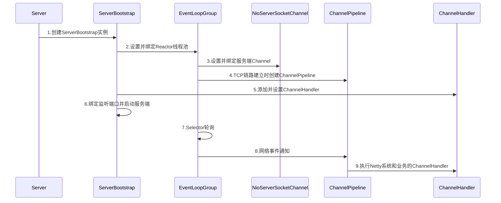

# Netty权威指南

## Java的I/O演进之路

### I/O基础入门

#### Linux网络I/O模型简介

Linux内核将所有外部设备都看作一个文件来操作，对一个文件的读写操作会调用内核提供的系统命令，返回一个file descriptor（fd）；

Unix提供了5种I/O模型：

- 阻塞I/O模型：默认情况下，所有文件操作都是阻塞的。如调用recvfrom，其系统调用直到数据包到达且被复制到应用进程的缓冲区中或发生错误时才返回，在此期间一直会等待（进程被阻塞）；
- 非阻塞I/O模型：recvfrom从应用层到内核的时候，如果该缓冲区没有数据的话，就直接返回EWOULDBLOCK错误，一般都对非阻塞I/O模型进行轮询检查这个状态，看内核是不是有数据到来；
- I/O复用模型：Linux提供select / poll，进程通过一个或多个fd传递给select或poll系统调用，阻塞在select操作上，这样select/poll可以帮我们侦测多个fd是否处于就绪状态。select / poll是顺序扫描fd是否就绪，而且支持的fd数量有限，因此使用受到了一些制约。Liniux还提供了一个epoll系统调用，epoll使用基于事件驱动方式代替顺序扫描，因此性能更高，当有fd就绪时，立即回调函数rollback；
- 信号驱动I/O模型：首先开启套接口信号驱动I/O功能，并通过系统调用sigaction执行一个信号处理函数（非阻塞）。当数据准备就绪时，就为该进程生成一个SIGIO信号，通过信号回调通知应用程序调用recvfrom来读取数据，并通知主循环函数处理数据；
- 异步I/O：告知内核启动某个操作，并让内核在整个操作完成后通知我们，与信号驱动模型的主要区别是，信号驱动I/O由内核通知我们何时可以开始一个I/O操作，后者由内核通知我们I/O操作何时已经完成；

#### I/O多路复用技术

- 在I/O编程过程中，可以利用多线程或I/O多路复用技术处理多个客户端同时接入的请求。I/O多路复用技术通过把多个I/O的阻塞复用到同一个select的阻塞上，从而使得系统在单线程的情况下可以同时处理多个客户端请求。
- 与传统多线程模型比，I/O多路复用的最大优势是系统开销小，系统不需要创建新的额外进程或线程，也不需要维护这些进程和线程的运行，从而降低系统的维护工作量，节省系统资源。
- 其主要应用场景：1.服务器需要同时处理多个处于监听状态或者多个连接状态的套接字；2.服务器需要同时处理多种网络协议的套接字；

epoll对于select的改进：

**1.支持一个进程打开的socket描述符（FD）数量不受限制（仅受限于操作系统的最大文件句柄数）**

select默认为1024，epoll支持FD数量为操作的最大文件句柄数，这个值与机器内存有关；

**2.I/O效率不会随着FD数目的增加而线性下降**

当socket很多时，由于网络延迟或链路空闲，任意时刻只有少部分的socket是活跃的，但是select/poll会每次线性扫描全部socket，所以导致效率线性下降。而epoll则是根据每个fd上面的callback函数实现，只有活跃的socket才会主动调用callback函数；

**3.使用mmap加速内核与用户空间的消息传递**

epoll通过内核用户空间mmap同一块内存来实现，避免了不必要的内存复制；

**4.epoll的API更加简单**

包括创建一个epoll、添加监听事件、阻塞等待所监听的事件发生、关闭epoll等；

## NIO入门

### 传统BIO编程（阻塞式I/O）

#### BIO通信模型

- 通常由一个独立的Acceptor线程负责监听客户端的连接，它接收到客户端连接请求之后为每个客户端创建一个新的线程进行链路处理，处理完成之后通过输出流返回响应给客户端，线程销毁；
- 该模型的最大问题就是缺乏弹性伸缩能力；

### 伪异步I/O编程

为了解决同步阻塞I/O面临的一个链路需要一个线程处理的问题，有人对它的线程模型进行了优化——后端通过一个线程池来处理多个客户端的请求接入，形成客户端个数M于线程池最大线程数N的比例关系，其中M可以远远大于N。通过线程池可以灵活地调配线程资源，设置线程的最大值，防止由于海量并发接入导致线程耗尽；

### NIO编程

**缓冲区Buffer**

- 在NIO中，所有数据都是用缓冲区处理的，在读取数据时，它是直接读到缓冲区中的，在写入数据时，写入到缓冲区中；
- Buffer实质上是一个数组，最常用的是ByteBuffer；

**通道Channel**

- 网络数据通过Channel读取和写入，Channel与流的不同之处在于Channel是双向的；
- Channel是全双工的，所以它可以比流更好地映射底层操作系统的API，特别是在UNIX网络编程模型中，底层操作系统的通道都是全双工的，同时支持读写操作；
- Channel分为两大类：用于网络读写的SelectableChannel和用于文件操作的FileChannel；

**多路复用器Selector**

- Selector提供选择已经就绪的任务的能力，它会不断地轮询注册在其上的Channel，如果某个Channel上发生了读或写事件，这个Channel就处于就绪状态，会被Selector轮询出来，然后通过SelectionKey可以获取就绪Channel的集合，进行后续的I/O操作；
- 一个Selector可以同时轮询多个Channel，由于JDK适用了epoll()代替传统的select实现，只需要一个线程负责Selector的轮询，就可以接入成千上万的客户端；

**NIO编程的优点**

- 客户端发起的连接操作是异步的，可以通过在多路复用器注册OP_CONNECT等待后续结果，不需要像之前的客户端那样被同步阻塞；
- SocketChannel的读写操作都是异步的，如果没有可读写的数据它不会同步等待，直接返回，这样I/O通信线程就可以处理其他的链路，不需要同步等待这个链路可用；
- 线程模型的优化：JDK的Selector在Linux等主流操作系统上通过epoll实现；

### AIO编程

NIO2.0引入了新的异步通道的概念，并提供了异步文件通道和异步套接字通道的是实现，异步通道提供以下两种方式获取操作结果：

- 通过java.util.concurrent.Future类来表示异步操作的结果；
- 在执行异步操作的时候传入一个java.nio.channels；

### 4种I/O的对比

| I/O                 | 同步阻塞I/O | 伪异步I/O         | 非阻塞I/O（NIO）       | 异步I/O（AIO ）                        |
| ------------------- | ----------- | ----------------- | ---------------------- | -------------------------------------- |
| 客户端个数：I/O线程 | 1:1         | M:N（M可以大于N） | M:1                    | M:0（不需要启动额外I/O线程，被动回调） |
| I/O类型（阻塞）     | 阻塞I/O     | 阻塞I/O           | 非阻塞I/O              | 非阻塞I/O                              |
| I/O类型（同步）     | 同步I/O     | 同步I/O           | 同步I/O（I/O多路复用） | 异步I/O                                |
| API使用难度         | 简单        | 简单              | 非常复杂               | 复杂                                   |
| 调试难度            | 简单        | 简单              | 复杂                   | 复杂                                   |
| 可靠性              | 非常差      | 差                | 高                     | 高                                     |
| 吞吐量              | 低          | 中                | 高                     | 高                                     |

### 选择Netty的理由

Netty的优点：

- API使用简单，开发门槛低；
- 功能强大，预置多种编解码功能，支持多种主流协议；
- 定制能力强，可以通过ChannelHandler对通信框架进行灵活地扩展；
- 性能高；
- 成熟、稳定，修复了已发现的所有JDK NIO BUG；
- 社区活跃，版本迭代周期短；
- 经历了大规模的商业应用考验，质量得到验证；

## TCP粘包/拆包问题

### TCP粘包/拆包

TCP底层并不了解上层业务数据的具体含义，它会根据TCP缓冲区的实际情况进行包的划分，所以在业务上认为，一个完整的包可能会被TCP拆分成多个包进行发送，也有可能把多个小的包封装成一个大的数据包发送，这就是所谓的TCP粘包和拆包问题；

#### TCP粘包/拆包问题说明

假设客户端分别发送了两个数据包D1和D2给服务端，由于服务端一次读取的字节数是不确定的，故可能出现：

1. 服务端两次读取分别读取到D1和D2，正常情况，无需处理；
2. 服务端一次读取到两个包，两个包粘在一起，即发生了TCP粘包，服务器可能将它们当作是一个包来处理；
3. 服务端第一次和第二次分别读到D1和D2_1、D2_2，D2包被拆包；
4. 服务端第一次和第二次分别读到D1_1、D1_2和D2，D1包被拆包；
5. D1和D2包比较大，读取期间发生多次拆包；

#### TCP粘包/拆包发生的原因

- 应用程序write写入的字节大小大于Socket的发送缓冲区大小；
- 进行MSS（最大报文长度，Maximum Segment Size）大小的TCP分段（即报文大小大于MSS）；
- 以太网帧的payload大于MTU（最大传输单元，Maximum Transmission Unit），进行IP分片（当发送的IP数据报比数据链路层的MTU大时，IP层就需要对数据进行分片，否则数据无法发送成功）；

#### 粘包问题的解决策略

由于底层的TCP无法理解上层的业务数据，所以在底层无法保证数据包不被拆分和重组，故只能通过上层的应用协议栈设计来解决：

- 消息定长，例如每个报文大小固定为200字节，不够则补空位；
- 在包尾增加回车换行符进行分割，例如FTP协议；
- 将消息分为消息头和消息体，消息头中包含表示消息总长度或消息体长度的字段；
- 更复杂的应用层协议；

#### 利用LineBaesdFrameDecoder解决TCP粘包问题

**LineBaesdFrameDecoder与StringDecoder原理分析**

- LineBasedFrameDecoder的工作原理是它依次遍历ByteBuf中的可读字节，判断是否有"\n"或"\r\n"，如果有，就以此为结束位置，从可读索引到结束位置区间的字节就组成了一行；
- StringDecoder将接收到的对象转成字符串，然后继续调用后面的Handler。LineBaesdFrameDecoder与StringDecoder的组合就是按行切换的文本解码器，它被设计用来支持TCP的粘包和拆包；

## 分隔符和定长解码器的应用

TCP以流的方式进行数据传输，上层的应用协议为了对消息进行区分，往往采用如下4种方式：

1. 消息长度固定，累计读取到长度总和为定长LEN的报文后，就认为读取到了一个完整的消息；
2. 将回车换行符作为消息结束符，如FTP协议，这种方式在文本协议中应用比较广泛；
3. 将特殊的分隔符作为消息的结束标志；
4. 通过在消息头中定义长度字段来表示消息的总长度；

对于固定长度和使用特殊分隔符的方案，Netty提供了FixedLengthFrameDecoder和DelimiterBasedDecoder；

## 编解码技术

当进行远程跨进程服务调用时，需要把被传输的Java对象编码为字节数组或ByteBuffer对象，而当远程服务读取到ByteBuffer对象或字节数组时，需要将其解码为发送时的Java对象，这被称为Java对象编解码技术；

### Java序列化的缺点

- 无法跨语言；
- 序列化后的码流太大；
- 序列化性能太低；

### 业界主流的编解码框架

#### Google的Protobuf

**特点**

- 结构化数据存储格式（XML，JSON等）；
- 高效的编解码性能；
- 语言无关、平台无关、扩展性好；
- 官方支持Java、C++和Python；

众多RPC框架选用的编解码框架

#### Facebook的Thrift

Thrift支持多种语言：C++、C#、Cocoa、Erlang、Haskell、Java、Ocami、Perl、PHP、Python、Ruby和Smalltalk；

Thrift支持三种比较典型的编解码方式：

- 通用的二进制编解码；
- 压缩二进制编解码；
- 优化的可选字段压缩编解码；

#### JBoss Marshalling

- JBoss Marshalling是一个Java对象的序列化API包，修正了JDK自带的序列化包的很多问题，且跟Serializable接口兼容，同时增加了一些可调的参数和附加特性。其优点：
- 可插拔的类解析器，提供更加敏捷的类加载定制策略，通过一个接口即可实现定制；
- 可插拔的对象替换技术，不需要通过继承；
- 可插拔的预定义类缓存表，可以减小序列化的字节数组长度，提升常用类型的对象序列化性能；
- 无须实现Serializable接口；
- 通过缓存技术提升对象的序列化性能；

## HTTP协议开发

### HTTP协议介绍

应用层的面向对象的协议，主要特点：

- 支持Client/Server模式；
- 简单——客户端向服务端发送请求时，只需要指定服务URL，携带必要的请求参数或消息体；
- 灵活——HTTP允许传输任意类型的数据对象，传输的内容类型由HTTP消息头中的Content-type加以标记；
- 无状态——协议对于事务处理没有记忆能力；

#### Netty HTTP服务端

**初始化需要添加的ChannelHandler**

- HttpRequestDecoder：Http请求消息解码器；
- HttpObjectAggregator：作用是将多个消息转换为单一的FullHttpRequest或者FullHttpResponse，原因是HTTP解码器在每个HTTP消息中会生成多个消息对象（1.HttpRequest / HttpResponse，2.HttpContent，3.LastHttpContent）；
- HttpResponseEncoder：HTTP响应编码器：
- ChunkedWriteHandler：作用是支持异步发送大的码流，例如大的文件传输，但不占用过多的内存，防止发生Java内存溢出（chunk是厚块的意思）；

## WebSocket协议开发

### HTTP协议的弊端

- HTTP协议为半双工协议（同一时刻只有一个方向上的数据传送）；
- HTTP消息冗长而繁琐，HTTP歇息包含消息头、消息体、换行符等，相比于其他二进制通信协议，冗长而繁琐；
- 针对服务器推送的黑客攻击，例如长时间轮询；

### WebSocket入门

- WebSocket是HTML5开始提供的一种浏览器与服务器间进行全双工通信的网络技术；
- 在WebSocket API中，浏览器与服务器只需要做一个握手的动作，然后浏览器和服务器之间就形成了一条快速通道，就可以之间互相传送数据了；

**WebSocket特点**

- 单一的TCP连接，采用全双工模式通信；
- 对代理、防火墙和路由器透明；
- 无头部信息、Cookie和身份验证；
- 无安全开销；
- 通过ping/pong帧保持链路激活；
- 服务器可以主动传递消息给客户端，不再需要客户端轮询；

#### WebSocket连接建立

为了建立一个WebSocket连接，客户端浏览器首先要向服务器发起一个**HTTP请求**，这个请求需要附加头信息"Upgrade: WebSocket"，表明这是一个申请协议升级的HTTP请求。服务端解析这些附加的头信息，然后生成应答信息返回给客户端，客户端与服务器的WebSocket连接就建立起来了，双方可以根据这个连接通道自由地传递信息，并且这个连接会持续存在直到客户端或服务端主动关闭连接；

#### WebSocket连接关闭

- 为关闭WebSocket连接，客户端和服务端需要通过一个安全的方法关闭底层TCP连接以及会话；
- 在正常情况下，底层的TCP连接应该先有服务器关闭。在异常情况下（例如在一个合理的时间周期后没有接收到服务器的TCP Close），客户端可以发起TCP Close操作；
- WebSocket的握手关闭消息带有一个状态码和一个可选的关闭原因，它必须按照协议要求发送一个Close控制帧，当对端接收到关闭控制帧指令时，需要主动关闭WebSocket连接；

### Netty WebSocket协议开发

**初始化需要添加的ChannelHandler**

- HttpServerCodec：将请求和响应编码或解码为HTTP消息；
- HttpObjectAggregator；
- ChunkedWriteHandler；

## 私有协议栈开发

### 私有协议介绍

跨节点的远程服务调用，除了链路层的物理连接外，还需要对请求和响应消息进行编解码。在请求和应答消息本身以外，也需要携带一些其他控制和管理类指令，如链路建立的握手请求和响应消息、链路检测的心跳消息等。当这些功能组合到一起之后，就会形成私有协议；

## 服务端创建

### Netty服务端创建源码分析

#### Netty服务端创建时序图

1. 创建ServerBootstrap实例，ServerBootstrap是Netty服务端的启动辅助类，它提供了一些列的方法用于设置服务端启动相关的参数；
2. 设置并绑定Reactor线程池。Netty的Reactor线程池是EventLoopGroup（Reactor是Reactor模型，可参考https://blog.csdn.net/qq924862077/article/details/81026740），实际上就是EventLoop的数组。EventLoop的职责是处理所有注册到本线程多路复用器Selector上的Channel，Selector的轮询操作由绑定的EventLoop线程run方法驱动，在一个循环体内循环执行。EventLoop的职责不仅仅是处理网络I/O事件，用户自定义的Task和定时任务Task也由EventLoop负责处理，这样线程模型就实现了统一；
3. 设置并绑定服务端Channel。ServerBootstrap类提供了channel()方法用于指定服务端Channel的类型，Netty会通过工厂类，利用反射创建NioServerScoektChannel对象；
4. 链路建立的时候创建并初始化ChannelPipeline。它本质就是一个负责处理网络事件的职责链，负责管理和执行ChannelHandler，网络事件以事件流的形式在ChannelPipeline中流转，由ChannelPipeline根据ChannelHandler的执行测录调度ChannelHandler的执行；
5. 添加并设置ChannelHandler。它是Netty提供给用户定制和扩展的关键接口，利用ChannelHandler用户可以完成大多数的功能定制，例如消息编解码、心跳、安全认证、TSL/SSL认证、流量控制和流量整形等。同时Netty也提供了大量的系统ChannelHandler供用户使用；
6. 绑定并启动监听端口。在绑定监听端口之前系统会做一系列的初始化和检测工作，完成之后，会启动监听端口，并将ServerSockerChannel注册到Selector上监听客户端连接；
7. Selector轮询。由Reactor线程NioEventLoop负责调度和执行Selector轮询操作，选择准备就绪的Channel集合；
8. 当轮询到准备就绪的Channel后，就由Reactor线程NioEventLoop执行ChannelPipeline的相应方法，最终调度并执行ChannelHandler；
9. ChannelPipeline根据网路事件的类型，执行Netty系统ChannelHandler和用户添加定制的ChannelHandler

#### Netty服务端创建源码分析