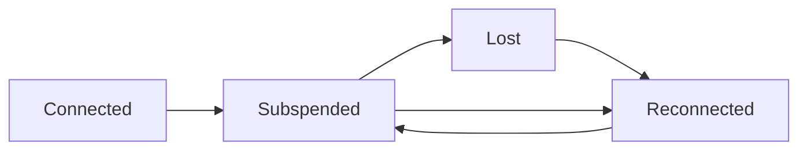
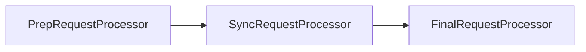
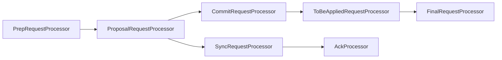
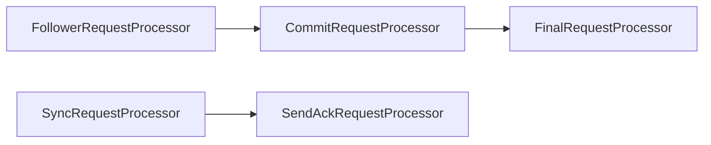

# ZooKeeper——分布式过程协同技术详解

## 简介

- ZooKeeper从文件系统API得到启发，提供一组简单的API，使得开发人员可以实现通用的协作任务，包括选举主节点、管理组内成员关系、管理元数据等；
- ZooKeeper包括一个应用开发库（主要提供Java和C两种语言的API）和一个用Java实现的服务组件；
- ZooKeeper的服务组件运行在一组专用服务器之上，保证了高容错性和可扩展性；

### ZooKeeper的使命

ZooKeeper可以在分布式系统中协作多个任务，一个协作任务是指一个包含多个进程的任务，这个任务可以是为了协作（如主从工作模式）或者是为了管理竞争（需实现互斥排他锁）；

#### ZooKeeper的使用实例

**Apache HBase**

HBase是一个通常与Hadoop一起使用的数据存储仓库，在HBase中，ZooKeeper用于选举一个集群内的主节点，以便于跟踪可用的服务器并保存集群的元数据；

**Apache Kafka**

ZooKeeper用于检测崩溃，实现主题的发现，并保持主题的生产和消费状态；

**Apache Solr**

使用ZooKeeper来存储集群的元数据，并协助更新这些元数据

#### ZooKeeper不适用的场景

不适合用作海量数据存储

#### 通过ZooKeeper构建分布式系统

- 本文分布式系统的定义：分布式系统是同时跨越多个物理主机，独立运行的多个软件组件所组成的系统；
- 分布式系统中的进程通信有两种选择：直接通过网络进行信息交换，或读写某些共享存储，而ZooKeeper是通过共享存储的模型来实现应用间的协作和同步原语。网络通信是分布式系统中并发设计的基础；

在真实的系统中，我们需要特别注意以下问题：

- **消息延迟**：消息传输会发生任意延迟，后发送的进程Q的消息可能会比先发送的进程P的消息先完成传送；
- **处理器性能**：操作系统的调度和超载也可能导致消息处理的任意延迟。如果发送或接收过程需要调度时间进行处理，消息延时会更高；
- **时钟偏移**：处理器时钟并不可靠，它们之间也会发生任意的偏移，因此，依赖处理器试着也许会导致错误的决策；

### 主从应用

在主从架构中，主节点进程负责跟踪从节点状态和任务的有效性，并分配任务到从节点，要实现主从模式的系统，我们必须解决以下三个关键问题：

- 主节点崩溃：如果主节点发送错误并失效，系统将无法分配新的任务或重新分配已失败的任务；
- 从节点崩溃：如果从节点崩溃，已分配的任务将无法完成；
- 通信故障：如果主节点和从节点之间无法进行信息交换，从节点将无法得知新任务分配给它；

#### 主节点失效

- 主节点失效时，我们需要有一个备份主节点，当主要主节点崩溃时，备份主节点接管主要主节点的角色，进行故障转移。新的主节点需要能恢复到旧主节点崩溃时的状态。我们需要通过ZooKeeper来获取已崩溃的主节点的信息；
- 主节点有效，备份主节点却认为主节点已崩溃。比如主节点的负载很高，导致消息延迟，备份主节点将会接管成为主节点的角色，执行所有必需的程序，最终可能成为第二个主节点，更糟的是，如果一些从节点无法与主要主节点通信，如由于网络分区错误导致，这些从节点可能会停止与主要主节点的通信，而与第二个主节点建立主从关系，这种场景中导致的问题被称为**脑裂**；

#### 从节点失效

如果从节点崩溃，已派发给从节点且尚未完成的任务需要从新派发。其中首要需求是主节点必须能够检测到从节点的崩溃，并确定哪些从节点是否有效以便派发崩溃节点的任务，还需要执行某些恢复过程来清除之前的状态；

#### 通信故障

首先，客户端可以告诉ZooKeeper某些数据的状态是临时状态，其次，ZooKeeper需要客户端定时发送是否存储的通知，如果一个客户端未能及时发送通知，那么所有从属于这个客户端的临时状态的数据将全部被删除。通过这两个机制，在崩溃或通信故障发生时，我们就可以预防客户端独立运行而发生的应用宕机；

#### 任务总结

我们可以得到以下主从架构的需求：

- 主节点选举：主节点可以给从节点分配任务；
- 崩溃检测：主节点必须具有检测从节点崩溃或失去连接的能力；
- 组成员关系管理：主节点必须具有知道哪个从节点可以执行任务的能力；
- 元数据管理：主节点和从节点必须通过某种可靠的方式来保存分配状态和执行状态的能力；

### 分布式协作的难点

#### CAP定律

- 一致性（Consistency）、可用性（Availability）、和分区容错性（Partition-tolerance），当设计一个分布式系统时，我们希望这三个属性全部满足，但是没有系统可以同时满足这三种属性；
- ZooKeeper的设计尽可能满足**一致性**和**可用性**，在发生网络分区时ZooKeeper也提供了只读能力；

## 了解ZooKeeper

### ZooKeeper基础

- 设计一个用于协作需求的服务的方法往往是提供原语列表，暴露出每个原语的实例化调用方法，并直接控制这些实例，比如：我们可以说分布式锁机制组成了一个重要的原语，同时暴露出创建、获取和释放三个调用方法；
- ZooKeeper并不直接暴露原语，取而代之，它暴露了由一小部分调用方法组成的类似文件系统的API，**以便允许应用实现自己的原语**；
- 通常使用菜谱（recipes）来表示这些原语的实现，菜谱包括ZooKeeper操作和维护一个小型的数据节点，这些节点被称为znode，采用类似于文件系统的层级树状结构进行管理；

#### API概述

znode节点可能含有数据也可能没有，如果包含则数据存储为字节数组，字节数组的具体格式特定于每个应用的实现，ZooKeeper并不直接提供解析的支持。ZooKeeper的API暴露了以下方法：

| 方法              | 说明                                     |
| ----------------- | ---------------------------------------- |
| create/path data  | 创建一个名为/path的znode，并包含数据data |
| delete/path       | 删除名为/path的znode                     |
| exists/path       | 检查是否存在/path的znode                 |
| setData/path data | 设置数据为data（只允许全部替换）         |
| getData/path      | 返回节点数据信息（只允许全部返回）       |
| getChildren/path  | 返回所有子节点列表                       |

#### znode的不同类型

**持久节点和临时节点**

- znode节点可以是持久（persistent）节点，也可以是临时（ephemeral）节点，持久节点只能通过调用delete来进行删除，临时节点则是在创建该节点的客户端崩溃或关闭了与ZooKeeper的连接时（或某个客户端主动删除该节点），这个节点会被删除；

- 可以通过持久节点保存一些数据，即时znode的创建者不再属于应用系统时，数据也可以保存下来而不丢失；
- 临时节点传达了应用某些方面的信息，仅当创建者的会话有效时这些信息必须有效保存；

**有序节点**

- znode还可以设置为有序节点，一个有序znode节点被分配唯一个单调递增的整数，有序znode提供了创建唯一名称znode的简单方式，同时也通过这种方式可以直观地查看znode的创建顺序；

- znode一共有4种类型：持久的、临时的、持久有序的、临时有序的；

#### 监视与通知

- 如果采用客户端轮询的方式，代价会非常大，因为会导致更高的延迟，而且ZooKeeper需要做更多的操作；
- 为了替换客户端的轮询，ZooKeeper采用了基于通知的机制：客户端向ZooKeeper注册需要接收通知的znode，通过对znode设置监视点来接收通知。监视点是一个单次触发的操作，意即监视点会触发一个通知，为了接收多个通知，客户端必须在每次通知后设置一个新的监视点（因为客户端收到通知后，该监视点相当于被消耗了，所以需要再次设置）；
- 如果客户端对一个znode设置了监视点后，znode发生了两个连续更新，第一次更新后，客户端在观察到第二次变化前就接收到了通知，然后读取znode中的数据。虽然ZooKeeper的状态变化传播给某些客户端时更慢，但保障了客户端以全局的顺序来观察ZooKeeper的状态；

#### 版本

每个znode都有一个版本号，它随着每次数据变化而自增。两个API操作可以有条件地执行：setData和delete。这两个调用以版本号作为转入参数，只有当传入参数的版本号与服务器上的版本号一致时调用才会成功（即乐观锁策略）。

### ZooKeeper架构

ZooKeeper服务器端运行于两种模式下：独立模式（standalone）和仲裁模式（quorum）。独立模式几乎与其术语所描述的一样，有一个单独的服务器，ZooKeeper状态无法复制。在仲裁模式下，具有一组ZooKeeper服务器，我们称为ZooKeeper集合（ZooKeeper ensemble），它们之间可以进行状态的复制，并同时服务于客户端的请求；

#### ZooKeeper仲裁

在仲裁模式下，ZooKeeper复制集群中的所有服务器的数据树，但如果让一个客户端等待每个服务器完成数据保存后再继续，延迟问题将无法接受。故需设置法定人数，其是指为使ZooKeeper工作必须有效运行的服务器的最小数量，这个数字也是服务器告知客户端已安全保存数据前，需要保存客户端数据的服务器的最小个数。

#### 会话

- 在对ZooKeeper集合执行任何请求前，一个客户端必须先与服务建立会话，客户端提交给ZooKeeper的所有操作均关联在一个会话上。当一个会话因某种原因而中止时，在这个会话期间的临时节点将会消失；
- 当一个客户端通过某一个特定语言套件来创建一个ZooKeeper的句柄时，它就会通过服务建立一个会话。客户端初始连接到集合中某一个服务器或一个独立的服务器。客户端通过TCP协议与服务器进行连接并通信，但当会话无法与当前连接的服务器继续通信时，会话就可能转移到另一个服务器上；
- 会话提供了顺序保障，同一个会话中的请求会以FIFO顺序执行，如果客户端拥有多个并发的会话，则FIFO顺序在多个会话之间未必能够保持；

### 开始使用ZooKeeper

#### 会话的状态和生命周期

- 会话的生命周期是指会话从创建到结束的时期，无论会话正常关闭还是因为超时而导致过期；
- 创建会话时需要设置会话超时这个参数，如果经过时间t之后服务接收不到这个会话的任何消息，服务就会声明会话过期；如果经过t/3的实践未收到任何消息，客户端将向服务器发送心跳消息，在经过2t/3时间后，ZooKeeper客户端开始寻找其他的服务器，此时它还有t/3时间去寻找；
- 在仲裁模式下，当客户端尝试连接到不同的服务器时，需要新服务器的Zookeeper状态比最后连接的服务器的ZooKeeper状态要新。ZooKeeper确保每一个变化对于所有其他已执行的更新是完全有序的，因此如果一个客户端在位置i观察到一个更新，它就不能连接到只观察到i' < i的服务上；

#### 通过ZooKeeper实现锁

- 为了获得一个锁，每个进程p尝试创建znode，名为/lock，如果p成功创建了znode，就表示它获得了锁并且可以继续执行其临界区域的代码；
- 潜在问题是进程p可能崩溃，导致这个锁永远无法释放，从而可能导致死锁，为了避免这种情况，我们不得不在创建这个节点时指定/lock为临时节点；
- 其他进程因znode存在而创建/lock失败，因此进程监听/lock的变化，并在检测到/lock删除时再次尝试创建节点来获得锁；

## 使用ZooKeeper进行开发（需结合源码和书上的代码查看）

### 建立ZooKeeper会话

ZooKeeper的API围绕ZooKeeper的句柄（handle）而构建，每个API调用都需要传递这个句柄，句柄代表与ZooKeeper之间的一个会话；

ZooKeeper句柄构造函数包含属性：

- connectString：包含主机名和服务器端口；
- sessionTimeout：以毫秒为单位，表示ZooKeeper等待客户端通信的最长时间，之后声明会话已死亡；
- watcher：用于接收会话事件的一个对象，需要我们自己创建。客户端使用Watcher接口来监控与ZooKeeper之间会话的健康情况，与ZooKeeper服务之间建立或失去连接时就会产生事件，它们同样还能用于监控ZooKeeper数据的变化，如果会话过期，也会通过Watcher接口传递事件来通知客户端的应用；

### 获取管理权

- 通过创建临时节点实现；
- 处理ConnectionLossException：发生于客户端于ZooKeeper服务端失去连接时，一般由于网络原因导致。处理ConnectionLossException异常时，需要找出哪个进程创建的/master节点，如果进程是自己，则开始成功Master角色（通过getData方法获取serverId）。
- 处理InterruptedException：源于客户端线程调用了Thread.interrupt，通常这是因为应用程序部分关闭，但还在被其他相关应用的方法使用。

#### 异步获取管理权

- ZooKeeper中所有同步调用方法都有对应的异步调用方法，通过异步调用，我们可以在单线程中同时进行多个调用；
- create的异步方法比同步方法多了两个参数：1.提供回调方法的对象；2.用户指定上下文信息；
- 因为只有一个单独的线程处理所有的回调调用，如果回调函数阻塞，所有后续回调调用都会被阻塞，所以一般不要在回调函数中集中操作或阻塞操作；

### 注册从节点

仍然是创建临时节点，创建时把从节点的状态信息存入znode节点中；

## 处理状态变化

- 在应用程序中，需要知道ZooKeeper集合的状态，备份主节点需要知道主节点已崩溃，从节点需要知道任务分配给了自己；
- 通过ZooKeeper提供的监视点机制，可以让备份主节点注册一个监视点来监视主节点锁（即临时节点）是否存在，如果主节点崩溃，主节点锁自动被删除，并通知所有备份主节点，然后备份主节点可以开始进行主节点选举；

### 单次触发器

- 事件（event）表示一个znode节点执行了更新操作，而一个监视点（watch）表示一个与之关联的znode节点和事件类型组成的单次触发器。当一个监视点被一个事件触发时，就会产生一个通知，通知是注册了监视点的应用客户端收到的事件报告的消息；

- 客户端设置的每个监视点与会话关联，如果会话过期，等待中的监视点将会被删除。但是监视点可以跨越不同服务端的连接而保持——当一个ZooKeeper客户端与一个ZooKeeper服务端连接断开后连接到集合中的另一个服务端，客户端会发送未触发的监视点列表，新的服务端检测已监视的znode节点在之前注册监视点之后是否已经发生变化，如果已经发生，则一个监视点的事件会被发送给客户端，否则在新的服务端上注册监视点；

**单次触发是否会丢失事件**

会，一个应用在接收到通知后，注册另一个监视点时，两个时间点之间可能有新事件发生。但是任何在接收通知与注册新监视点之间的变化情况，均可以通过读取ZooKeeper的状态信息来获得；

### 如何设置监视点

- ZooKeeper的API中的所有读操作：getData、getChildren和exists均可以选择在读取的znode节点上设置监视点，通过实现Watcher接口来设置监视点；
- 监视点有两种类型：数据监视点和子节点监视点，创建、删除或设置一个znode节点的数据都会触发数据监视点，exists和getData这两个操作可以设置数据监视点。只有getChildren操作可以设置子节点监视点，这种监视点只有在znode子节点创建或删除时才被触发；
- 监视点一旦设置就无法移除，要想移除一个监视点，只能触发它或让会话被关闭或过期；

### 普遍模型

1. 调用异步接口；
2. 实现回调对象，并传入异步调用函数中；
3. 如果操作需要设置监视点，则实现一个Watcher对象，并传入异步调用函数中；

### 主-从模式的例子

主从模式的组件需要等待处理的变化情况：

- **管理权变化**：通过竞争/master临时节点，竞争失败时作为备份主节点设置监视点来实现；
- **主节点等待从节点列表的变化**：主节点使用getChildren获取有效的从节点列表，同时监控列表的变化；
- **主节点等待新任务进行分配**；
- **从节点等待分配新任务**；
- **客户端等待任务的执行结果**；

### 通过监视点代替显式缓存管理

从应用的角度来看，客户端每次都是通过访问ZooKeeper来获取给定znode节点的数据、一个znode节点的子节点列表或其他相关的ZooKeeper状态。更高效的方式为客户端本地缓存数据，并在需要时使用这些数据，一旦数据发生变化，你让ZooKeeper通知客户端，客户端就可以更新缓存的数据；

### 顺序的保障

#### 写操作的顺序

ZooKeeper状态会在所有服务端所组成的全部副本中进行复制，服务端对状态的变化的顺序达成一致，并使用相同的顺序执行状态的更新。如一个ZooKeeper的服务端执行了先创建一个节点然后删除，所有的在集合中的服务端均需要以相同的顺序执行这些变化（但是不需要同时执行）；

#### 读操作的顺序

- ZooKeeper客户端总是会观察到相同的更新顺序，但是可能是在不同的时间观察到；
- 为了避免读到过去的数据（如c1与c2，c1修改了ZooKeeper状态，状态同步到了s1和s2，此时如果c1通过其他方式告诉c2 ZooKeeper状态变化了，然后c3获取变化时可能连接到s3，s3还没来得及更新，所以造成读到过期的数据），应用程序应该使用ZooKeeper（设置监视点）来进行所有涉及ZooKeeper状态的通信；

#### 通知的顺序

ZooKeeper对通知的排序涉及其他通知和异步响应，以及对系统状态个更新的顺序。

### 监视点的羊群效应和可扩展性

- 避免在一个特定节点设置大量的监视点，最好是每次在特定的znode节点上，只有少量（最好是一个）的客户端设置监视点；
- 当必须在特定节点设置多个监视点时，如多个客户端竞争一个锁，可以采用创建有序节点/locl/lock-的方式，序列号最小的客户端获得锁，没有获得锁的客户端监视前一个客户端；
- 由于设置一个监视点需要在服务端创建一个Watcher对象，设置一个监视点会使服务端的监视点管理器的内存消耗增加约250-300字节，因此开发者必须时刻注意设置的监视点数量；

## 故障处理

故障发生的主要点有三个：ZooKeeper服务、网络、应用程序，故障恢复取决于所找到的故障发生的具体位置；

### 可恢复的故障

- ZooKeeper客户端库与ZooKeeper服务的连接丢失时，会使用Disconnected事件和ConnectionLossException异常来表示自己无法了解当前的系统状态；
- ZooKeeper客户端库会积极地尝试，使自己离开这种情况，它会不断尝试连接另一个ZooKeeper服务器器，直到重新建立一个会话。一旦会话重新建立，ZooKeeper会产品一个SyncConnected事件，并开始处理请求。ZooKeeper还会注册之前已经注册过的监视点，并会对失去连接这段时间发生的变更产生监视点事件；

### 不可恢复的故障

- 有些情况下会导致会话无法恢复而必须被关闭，这种情况最常见的原因是会话过期，另一个原因是已认证的会话无法再次与ZooKeeper完成认证；
- 当客户端无法提供适当的认证信息来完成会话的认证时，或Disconnected事件后客户端重新连接到已过期的会话，就会发生不可恢复的故障；
- 处理不可恢复故障的最简单方法就是中止进程并重启，这样可以使进程恢复原状，通过一个新的会话重新初始化自己的状态；

### Leader选举和外部资源

- ZooKeeper为所有客户端提供了系统的一致性视图，只要客户端与ZooKeeper进行任何交互操作，ZooKeeper都会保持同步；
- 当运行客户端的主机发生过载，就会开始发生交换、系统颠簸或因已超负荷的主机资源的竞争而导致的进程延迟，这些都会影响与ZooKeeper交互的及时性；
- 一方面，ZooKeeper无法及时地与ZooKeeper服务器发送心跳信息，导致ZooKeeper的会话超时，另一方面，主机上本地线程的调度会导致不可预知的调度：一个应用线程认为会话仍然处于活动状态，并持有主节点，需等待ZooKeeper线程有机会运行时才会通知会话已经超时；

解决这个问题有几种方法：

1. 确保你的应用不会在超载或时钟偏移的环境中运行，监控负载可以检测到环境出现问题的可能性，时钟同步程序可以保证系统时钟的同步；
2. 通过ZooKeeper扩展对外部设备协作的数据，使用一个名为隔离的技巧，分布式系统中常常使用这种方法用于确保资源的独占访问——创建Master/Leader节点时，可以获得Stat结构的信息，其中该结构的成员之一为czxid，表示创建该节点时的zxid，zxid为唯一的单调递增的序列号，因此我们可以使用czxid作为一个隔离的符号。当我们对外部资源请求时，需要提供这个隔离符号，如果外部资源已经接收到更高版本的隔离符号的请求或连接时，我们的请求或连接就会被拒绝；

## ZooKeeper注意事项

### 使用ACL（Access Control List）

- 对于ZooKeeper，开发人员往往负责管理访问控制的权限，而不是管理员，这是因为每次创建znode节点时，必须设置访问权限，而且子节点并不会继承父节点的访问权限，访问权限的检查也是基于每一个znode节点的；
- ZooKeeper通过访问控制表（ACL）来控制访问权限，一个ACL包括以下形式的记录：scheme: auth-info，其中scheme对应了一组内置的鉴权模式，auth-info为对于特定模式所对应的方式进行编码的鉴权信息。ZooKeeper通过检查客户端进程访问的每个节点时提交上来的授权信息来保证安全性，如果一个进程没有提供鉴权信息，或者鉴权信息于要请求的znode节点的信息不匹配，进程就会收到一个权限错误；
- 调用addAuthInfo()方法为ZooKeeper增加鉴权信息，其中scheme表示所采用的鉴权模式，auth表示发送给服务器的鉴权信息；
- ZooKeeper在句柄创建后就会调用该方法来添加鉴权信息，进程中可以多次调用该方法，为一个ZooKeeper句柄添加多个权限的身份；

### 恢复会话

- 假如你的ZooKeeper客户端崩溃，之后恢复运行，应用程序在恢复运行后需要处理一系列的问题。建议客户端不要使用任何之前从ZooKeeper获取的缓存状态，而是使用ZooKeeper作为协作状态的可信来源；
- 第二个重要问题是客户端崩溃时，已经提交给ZooKeeper的待处理操作也许已经完成了，由于客户端崩溃导致无法收到确认消息，ZooKeeper无法保证这些操作肯定会成功执行。因此客户端在恢复时也许需要进行一些ZooKeeper状态的清理操作，以便完成某些未完成的任务；
- 对于会话过期，不能认为是客户端崩溃，也可能是因为网络问题或其他问题过期。比如Java中的垃圾回收。在会话过期的情况下，客户端需要ZooKeeper状态也许已经发生了改变，或者客户端对ZooKeeper的请求也许未完成；

### 当znode节点重新创建时，重置版本号

znode节点被删除并重建后，其版本号将会被重置。

### 顺序性保障

ZooKeeper声明了对一个会话中所有客户端操作提供顺序性的保障，但还是会存在ZooKeeper控制之外某些情况，可能会改变客户端操作的顺序；

#### 连接丢失时的顺序性

对于连接丢失事件，ZooKeeper会取消等待中的请求，对于同步方法的调用客户端库会抛出异常，对于异常请求调用，客户端调用的回调函数会返回结果码来标识连接丢失。

#### 同步API和多线程的顺序性

多线程情况下可能因为同步API的阻塞导致操作顺序发生变化；

### 数据字段和子节点的限制

ZooKeeper对数据字段的传输限制默认为1MB，没有任何基本原则可以组织ZooKeeper使用其他值，更大或更小的限制。设置限制值可以保证高性能，默认限制已经足够大，使用时应该避免接近该限制值的使用；

## Curator：ZooKeeper API的高级封装库

Curator隐藏了连接管理的复杂操作，实现了锁（lock）、屏障（barrier）、缓存（cache）等，还实现了fluent式的开发风格的接口。Curator还提供了namespace、自动重连和一些其他组件，使应用程序更加健壮；

### Curator客户端程序

retryPolicy属性可指定重连时的策略；

### 流畅式（fluent）API

就是Builder模式

### 监听器

监听器（listener）负责处理Curator库所产生的事件，使用这种机制时，应用程序中会实现一个或多个监听器，并将这些监听器注册到Curator实例中，当有事件发生时，这些事件就会传递给所有已注册的监听器；

### Curator中状态的转换

Curator中暴露了与ZooKeeper的不同状态：SUSPENDED、LOST状态

### 两种边界情况

Curator可以对在有序节点的创建过程中发生的错误情况和删除一个节点时的错误进行很好的处理；

**有序节点的情况**

CreateBuilder提供了一个withProtection方法来通知Curator客户端，在创建的有序节点前添加一个唯一标识符，如果create操作失败了，客户端就会开始重试操作，而重试操作的一个步骤就是验证是否存在一个节点包含这个唯一标识符；

**删除节点的保障**

DeleteBuilder接口中的guaranteed方法可以保障delete操作执行成功（失败时会执行重试）；

## ZooKeeper内部原理

### 请求、事务和标识符

- ZooKeeper服务器会在本地处理只读请求，ZooKeeper在处理以只读请求为主要负载时，性能会很高；
- 会改变ZooKeeper状态的客户端请求将会被转发给Leader，Leader执行响相应的请求，并形成状态的更新， 我们称为事务；
- 当Leader产生了一个事务，就会该事务分配一个标识符——ZooKeeper的会话ID，通过zxid对事务进行标识，就可以按照Leader指定的顺序在服务中按序执行；

### Leader选举

- Leader是集群中的服务器选择出来的一个服务器，并会一直被集群所认可，设置Leader的目的是为了为客户端所发起的ZooKeeper状态变更请求进行排序，Leader将每一个请求转换为一个事务，将这些事务发送给Follower，确保集群按照Leader确定的顺序接受并处理这些事务；
- 每个服务器启动后进入LOOKING状态，开始选举一个新的Leader或查找已存在的Leader。如果所有服务器均处于LOOKING状态，则服务器直接按就会进行通信来选举一个Leader。选举中胜出的服务器会进入LEADING状态，其他服务器进入FOLLOWING状态；
- 当有一个服务器进入LOOKING状态，就会向集群中每个服务器发送一个通知消息，该消息包括该服务器的投票信息，投票中包含服务器标识符（sid）和最近执行的事务的zxid信息。
- 最新的服务器（zxid最大）将赢得选举，如果多个服务器zxid相同，则sid值最大的服务器将赢得选举；

### Zab（ZooKeeper Atomic Broadcast protocol）：状态更新的广播协议

Zab协议用于让服务器提交事务，其步骤为：

- Leader向所有Follower发送一个提案（proposal）消息p；
- 当一个Follower接收到消息p后，会响应leader一个ACK消息，通知leader其已接受该提案；
- 当收到仲裁数量的服务器发送的确认消息后，leader就会发送消息通知follower进行提交操作；

### 观察者

观察者（Observer）不参与选举过程，它们仅仅学习经由INFORM消息提交的提议；

- Follower从一次广播中获取提议内容，并从接下来的一条提交消息中获取zxid，但是Observer只获取一条包含已提交提议的内容的INFORM消息；
- 引入观察者的一个主要原因是提高读请求的可扩展性，通过加入多个观察者，我们可以在不牺牲写操作的吞吐率的前提前服务更多的读操作（即观察者的服务器不参与投票，可提供读服务）；
- 采用观察者的另一个原因是进行跨多个数据中心的部署，由于数据中心之间的网络链接延时，将服务器分散于多个数据中心将明显地降低系统的速度，引入观察者后，更新请求能够先以高吞吐量和低延迟的方式在一个数据中心内执行，接下来再传播到异地的其他数据中心得到执行；

### 服务器的构成

Leader、Follower、Observer根本上都是服务器。ZooKeeper在实现服务器时使用的主要抽象概念是请求处理器，请求处理器是处理流水线上不同阶段的抽象；

#### 独立服务器

ZooKeeper中最简单的流水线是独立服务器，它包含三种处理器;

- PrepRequestProcessor：接受客户端的请求并执行，处理结果是生成一个事务（只有写操作会生成）；
- SyncRequestProcessor：负责将事务持久化到磁盘上；
- FinalRequestProcessor：如果Request对象包含事务数据，该处理器会接受对ZooKeeper数据树的修改，否则该处理器会从数据树中读取数据并返回给客户端；

#### 群首服务器

- ProposalRequestProcessor：准备一个提议，并将其发送给Folleower。并把所有请求都转发给CommitRequestProcessor，如果是写操作，还会转发给SyncRequestProcessor；
- AckRequestProcessor处理器负责接收每个服务器的确认消息；
- CommitRequestProcessor会将收到的足够多的确认消息的提议进行提交；

#### 追随者和观察者服务器

- 追随者服务器中会用到的请求处理器并不是一个单一序列的处理器，而且输入也有不同的形式：客户端请求、提议、提交事务；
- FollowerRequestProcessor接收并处理客户端请求，之后转发请求到CommitRequestProcessor，如果是写请求还会转发到群首服务器；
- 当Leader接收到一个新的写请求操作时，直接地或通过其他追随者服务器来生成一个提议，之后转发到追随者服务器，当收到一个提议，追随者服务器会发送这个提议到SyncRequestProcessor。SyncRequestProcessor会向Leader发送确认消息，当Leader接收到足够确认消息来提交这个提议时，Leader就会发送提交事务消息给追随者，同时也会发送INFORM消息给观察者服务器；
- 为了保证执行的顺序，CommitRequestProcessor会在收到一个写请求时暂停后续的请求处理，在这之后的任务读取请求都将被阻塞。通过等待的方式，请求可以被保证按照接收的顺序来被执行；
- 观察者服务器的请求流水线与追随者非常相似，但是因为观察者服务器不需要确认提议消息，因此观察者服务器并步需要发送确认消息给群首服务器，也不用持久化事务到硬盘；

### 本地存储

SyncRequestProcessor就是用于在处理提议时写入日志和快照

#### 日志和磁盘的使用

- 服务器通过事务日志来持久化事务，在接受一个提议时，一个服务器就会将提议的事务持久化到事务日志中，该日志保存在服务器的本地磁盘中，事务将会按照顺序追加其后，服务器会时不时地滚动日志，即关闭当前文件并打开一个新的文件；
- 通过组提交和补白可以让ZooKeeper运行的更快。组提交（Group Commits）是指在一次磁盘写入时追加多个事务，这将使持久化多个事务只需要一次磁道寻址的开销；
- 补白（padding）是指在文件中预分配磁盘存储块，这样做，对于涉及存储块分配的文件系统元数据的更新，就不会显著影响文件的顺序写入操作；

#### 快照

快照是ZooKeeper数据树的拷贝副本，每一个服务器会经常以序列化整个数据树的方式来提取快照，并将这个提取的快照保存到文件中；

每一个快照文件都会以快照开始时最后一个被提交的事务作为标记，我们将这个时间戳即为TS，如果服务器最后加载快照，它会重播在TS之后的所有事务日志中的事务；

### 服务器与会话

- ZooKeeper服务器的一个重要任务就是跟踪并维护会话（Session），在独立模式下，单个服务器会跟踪所有的会话，而在仲裁模式下则由群首服务器来跟踪和维护，而追随者服务器仅仅是简单地把客户端连接地会话信息转发给群首服务器；
- 为了保证会话的存活，服务器需要接收会话的心跳信息，形式可以是一个新的请求或者显式的ping消息；
- 对于管理会话的过期有两个重要的要点，一个称为过期队列ExpiryQueue，用于维护会话的过期。它使用bucket来维护会话，每个bucket对应一个某时间范围内过期的会话，群首服务器每次会让一个bucket的会话过期；

### 服务器与监视点

- 为了在服务端管理监视点，ZooKeeper的服务端实现了监视点管理器WatchManager，一个WatchManager类的实例负责管理当前已被注册的监视点列表，并负责触发它们；
- 在服务端触发了一个监视点，最终会传播到客户端，负责处理传播的为服务器的cnxn对象（ServerCnxn类），此对象标识客户端和服务器端的连接并实现了Watcher接口；
- 监视点只会保存在内存，而不会持久化到磁盘，当客户端和服务端的连接断开时，它的所有监视点会从内存中清除，因为客户端库也会维护一份监视点的数据，在重连之后监视点数据会再次被同步到服务端；

### 客户端

- 客户端库中有2个主要的类：ZooKeeper和ClientCnxn，ZooKeeper类实现了大部分API，写客户端应用程序时必须实例化这个类来建立一个会话，一旦建立起一个会话，ZooKeeper就会使用一个会话标识符来关联这个会话；
- ClientCnxn类管理连接到server的Socket连接，该类维护了一个可连接的ZooKeeper的服务器列表，并当连接断掉的时候无缝地切换到其他地服务器。当重连到一个其他的服务器时会使用同一个会话（如果没有过期），客户端也会重置所有的监视点到刚连接的服务器上；

### 序列化

对于网络传输和磁盘保存的序列化消息和事务，ZooKeeper使用了Hadoop中的Jute来做序列化；

## 运行ZooKeeper

#### 配置ZooKeeper服务器

zoo.cfg文件为ZooKeeper的配置文件，多个服务器如果角色相似可以共享一个文件，data目录下的myid文件用于区分各个服务器，每个服务器的data目录是唯一的，服务器ID将myid文件作为一个索引引入到配置文件中；

**基本配置**

- clientPort：服务器监听的TCP端口，默认2181；
- dataDir和：dataDir用于配置内存数据库保存的模糊快照的目录，如果某个服务器为集群中的一台，id文件也保存在该目录下；
- dataLogDir：dataLogDir指定事务日志存储目录，最佳实践是使用专用的日志存储设备；
- tickTime：单位为毫秒，指定ZooKeeper集群中使用的超时时间单位，最小的超时时间为一个tick时间，客户端最小会话超时时间为两个tick时间，tickTime默认值为3000毫秒；

**存储配置**

- preAllocSize：用于设置预分配的事务日志文件的大小，以KB为单位，默认值为64MB；
- snapCount：指定每次快照之间的事务数，默认值为100000。当ZooKeeper重启后需要恢复其状态，恢复时两大时间因素分别是为恢复状态而读取快照的时间以及快照启动后所发生的事务的执行时间。执行快照可以减少读入快照文件后需要应用的事务数量，但是进行快照时也会影响服务器性能。集群中的所有服务器最好不要在同一时间进行快照操作，因此每次快照中实际的事务数为一个接近snapCount的值的随机数；
- autopurge.snapRetainCount：当进行清理数据操作时，需要保留在快照数量和对应的事务日志文件数量，该值指定了ZooKeeper在进行定期执行的垃圾回收时需要保留的快照数，默认值为3，也是该值的最小值；
- autopurge.purgeInterval：对快照和日志进行垃圾回收操作的时间间隔的小时数；
- fsync.warningthresholdms：触发警告的存储同步时间阈值，单位毫秒，默认值为1000毫秒。服务器在应答变化消息前会同步变化情况到存储中，如果同步系统调用消耗了太长时间，系统性能就会受到严重影响，服务器会跟踪同步调用的持续时间，如果超过这个值，就会产生一个警告消息；
- weight.x=n：常常以一组参数进行配置，指定组成一个仲裁机构的某个服务器的权重为n，默认所有服务器为1；
- traceFile：用于提供ZooKeeper进行的操作的详细视图；

**网络配置**

- globalOutstandingLimit：ZooKeeper中待处理请求的最大值。客户端提交请求比ZooKeeper服务端处理请求要快很多，服务端将会对接收到的请求队列化，最终可能导致服务端的内存溢出。因此如果待处理请求达到globalOutstandingLimit值就会限制客户端的请求（和线程池的机制差不多），默认值为1000；
- maxClientCnxns：允许每个IP地址的并发socket连接的最大数量，默认值为60个并发连接；
- clientPortAddress：限制客户端连接到指定的接收信息的地址上（可用于设置为内网接口地址，从而使服务器只在内网接受客户端的连接）；
- minSessionTimeout：最小会话超时时间，单位为毫秒，客户端建立一个连接后就会请求一个明确的超时值，客户端实际获得的超时值不会低于这个值，默认值为tickTime值的两倍；
- maxSessionTimeout：会话的最大超时时间值；

**集群配置**

- initLimit：对于追随者最初连接到群首时的超时值，单位为tick值的倍数。该值取决于群首与追随者之间的网络传输速度情况，以及传输的数量大小；
- syncLimit：追随者与群首进行sync操作时的超时值，单位为tick值的倍数；
- leaderServes：配置值为yes或no，指示群首服务器是否为客户端提供服务，默认为yes；
- server.x=[hostname]: n: n[: observer]：服务器x的配置参数，x值为id值，hostname为服务器在网络n中的名称，同时后面跟了两个TCP端口号，第一个端口号用于事务的发送，第二个用于群首选举，典型的配置为2888: 3888。如果最后一个字段标记了observer属性，服务器就会进入观察者模式；
- cnxTimeout：在群首选举打开一个新的连接的超时值；
- electionAlg：选举算法的配置选项，除了默认配置外，其他算法都已经弃用了；

**非安全配置**

- forceSync：通过yes或no选项可以控制是否将数据信息同步到存储设备上，同步系统调用的消耗很大，而且也是事务处理中最大的延迟原因之一，如果配置为no，可以提高性能，但代价是服务器崩溃或停电故障时可恢复性；
- skipACL：跳过所有ACL检查；

**日志**

ZooKeeper使用SL4FJ库作为日志的抽象层，其配置文件为log4j.properties，系统会从classpath中加载这个文件；

### 配置ZooKeeper集群

#### 多数原则

当集群中拥有足够的ZooKeeper服务器来处理请求时，我们称这组服务器的集合为仲裁法定人数，我们不希望有两组不相交的服务器集合同时处理请求，否则会进入脑裂模式，可通过定义仲裁法定人数的数量至少为所有服务器中的多数来避免这个问题；

#### 法定人数的可配置性

进行分组配置时，我们会将服务器组成不相交的集合并分配服务器的权重，使多个组中的服务器形成多数投票原则；

#### 观察者

观察者为ZooKeeper服务器中不参与投票但保障状态更新顺序的特殊服务器，需要在观察者服务器的配置文件中添加：

`peerType=observer`

同时还需要在所有服务器的配置文件中添加该服务器的observer定义：

`server.1:localhost:2181:3181:observer`

### 重配置

- 重配置不仅可以让我们改变集群成功的配置，还可以修改网络参数配置，需要将重配置参数与静态的配置文件分离，单独保存在dynamicConfigFile参数和链接这两个配置文件；
- 另一种方式可以使ZooKeeper的服务器数量更具弹性，而不需要改变客户端的配置，即使用一个IP地址，该地址可以解析为多个地址；

### 配额管理

ZooKeeper初步提供了znode节点数量和节点数据大小的配额管理的支持，我们可以通过配置来指定某个子树的配额，该子树就会被跟踪，如果该子树超过了配置限制，就会记录一条警告日志，但操作请求还是可以继续执行。

### 多租赁配置

当服务于多租赁的情况下时，运维人员一般会将数据树分割为不同的子树，每个子树为某个应用程序所专用。开发人员在设计应用程序时可以考虑在其使用的znode节点前添加前缀；

### 四字母命令

- ruok：提供有限的服务器的状态信息；
- stat：提供服务器的状态信息和当前活动的连接情况，状态信息包括一些基本的统计信息，还包括该服务器当前是否处于活动状态；
- dump：提供会话信息，列出当前活动的会话信息以及这些会话的过期时间，该命令只能在群首服务器上运行；
- conf：列出服务器启动运行所适用的基本配置参数；
- wchs：列出该服务器所跟踪的监视点的简短摘要信息；
- cons：列出该服务器上每个连接的详细统计信息，crst重置这些连接信息中的计数器为0；