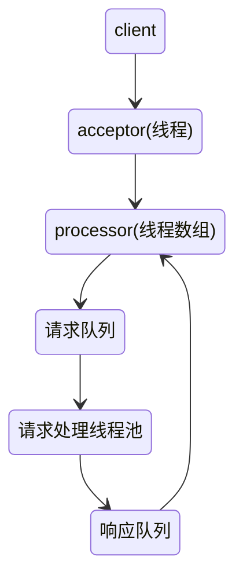
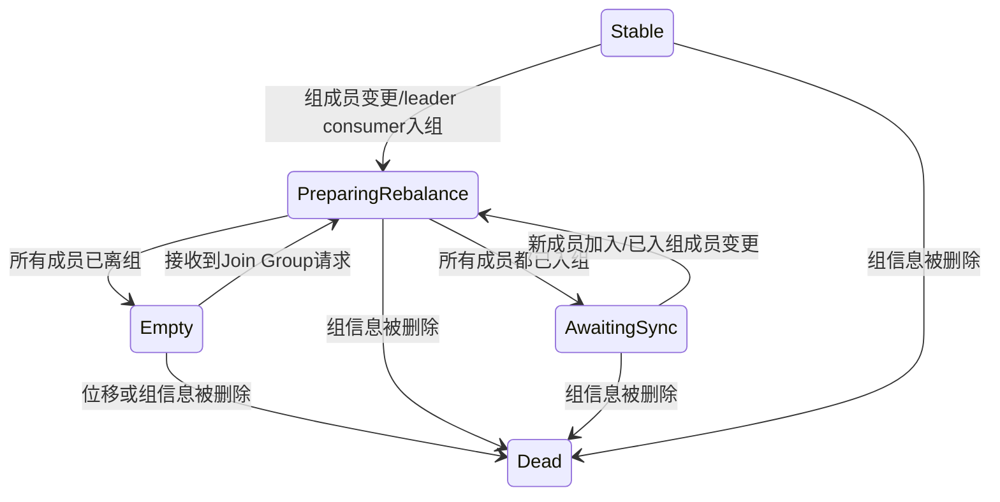

# 《Apache Kafka实战》

## 认识Apache Kafka

### 消息引擎系统

1. 生产者消费者解耦；
2. 可集成进任意系统；
3. 异步消息传输；

#### 消息设计

消息引擎系统的消息必须要语义清晰且格式通用，Kafka消息用二进制方式保存，为结构化的消息；

#### 传输协议设计

Kafka自己设计了一套二进制的消息传输协议，而没有采用诸如Google Protocol Buffers这样的框架；

#### 消息引擎范型

传输协议作为一个基础构建块，其服务于消息引擎系统实现的消息引擎范型，一个消息引擎范型是一个基于网络的架构范型，描述了消息引擎系统的两个不同的子部分是如何互连且交互的；

最常见的两种消息引擎范型是**消息队列模型**和**发布/订阅模型**：

- 消息队列模型是基于队列提供消息传输服务的，多用于进程及线程间通信。该模型定义了消息队列（queue）、发送者（sender）和接收者（receiver），提供了一种点对点的消息传递方式；
- 发布/订阅模型，它有主题的概念，一个topic可以理解为逻辑语义相近的消息的容器，也定义了发布者（publisher）和订阅者（subscriber）。发布者生产消息并发送到指定的topic，所有订阅了该topic的订阅者都可以接收到该topic下的所有消息；

Kafka支持这两种模型；

#### Java消息服务

- 即Java Message Service，它是一套API规范，提供了很多接口用于实现分布式系统间的消息传递；
- 很多主流的消息引擎系统都完全支持JMS规范，如ActiveMQ、RabbitMQ和Kafka等，但是Kafka并没有完全遵照JMS规范；

### Kafka概要设计

**吞吐量/延时**

- 吞吐量就是某种处理能力的最大值，对于Kafka，吞吐量就是每秒能够处理的消息数或每秒能够处理的字节数；
- 延时可以表示客户端发起请求与服务器处理请求并发送响应给客户端之间的这段时间；

Kafka依靠以下4点达到了高吞吐量、低延时的设计目标：

- 大量使用操作系统页缓存，内存操作速度快且命中率高
- Kafka不直接参与物理I/O操作，而是交由操作系统来完成
- 采用追加（append）写入方式，摒弃了缓慢的磁盘随机读写操作
- 使用以sendfile为代表的零拷贝技术加强网络间的数据传输效率

**零拷贝**：在内核驱动程序处理I/O数据的时候，它不再需要进行上下文的切换，节省了内核缓冲区与用户态应用程序缓冲区之间的数据拷贝，同时它利用直接存储器访问技术（Direct Memory Access，DMA）执行了I/O操作，因此也避免了OS内核缓冲区之间的数据拷贝，因而得名零拷贝；

**消息持久化**

Kafka要持久化消息，这样做的好处是：

- 解耦消息发送与消息消费；
- 实现灵活的消息处理：可以很方便地实现消息重演（处理已经处理过地消息）

Kafka实现持久化的设计：所有数据都会被写入文件系统的持久化日志中，之后Kafka服务器才会返回给客户端通知它们消息已被成功写入，这样既实时保存了数据，又减少了Kafka程序对内存的消耗，从而将节省的内存留给页缓存使用；

**负载均衡与故障转移**

- 负载均衡：Kafka的负载均衡通过智能化的分区领导者选举（partition leader election）来实现；
- 故障转移：Kafka使用会话机制来支持故障转移，每台服务器启动后会以会话的形式把自己注册到ZooKeeper服务器上，一旦该服务器出现问题，与ZooKeeper的会话便会超时失效，此时Kafka集群会选举出另一台服务器来完全代替这台服务器继续提供服务

**伸缩性**

每台Kafka服务器（Broker）的状态交由ZooKeeper保管，，可以很轻松地对集群进行扩容

### Kafka基本概念与术语

Kafka核心架构：

- 生产者发送消息给Kafka broker；
- 消费者从Kafka broker读取消息；
- Kafka broker依托ZooKeeper集群进行服务的协调管理；

#### 消息

Kafka的消息由消息头部、key和value组成，消息头部包括消息的CRC码、消息版本号、属性、时间戳、键长度和消息体长度等信息；

- **Key**：消息键，决定消息被保存在某个topic下的哪个partition（分区）
- **Value**：消息体，保存实际的消息数据
- **TimeStamp**：消息发送时间戳，用于流式处理及其他依赖时间的处理语义，不指定则取当前时间

#### topic与partition

- topic代表了一类消息，它由多个partition组成，每个partition都有自己的序列号，通常从0开始；
- partition的引入没有太多业务含义，单纯地为了提高吞吐量。在创建topic的时候可以根据集群实际配置设置具体的partition数，实现整体性能的最大化；

#### offset

topic partition下地每条消息都被分配一个位移值。通过topic、partition、offset即可找到唯一定位的那条消息。

#### replica

Kafka实现高可靠性的途径是依靠冗余机制，多个副本（replica）备份了多份日志。副本分为领导者（leader replica）和追随者（follower replica）；

#### leader和follower

- follower不提供服务给客户端，仅仅被动地向leader获取数据。当leader所在的broker宕机时，Kafka会从剩余的replica中选举出新的leader；
- Kafka保证同一个分区的多个副本一定不会分配在同一台broker上。如果同一个broker上有同一个分区上的多个副本，将无法实现备份冗余效果；

#### in-sync replica（ISR）

- 与leader replica保持同步的replica集合
- Kafka动态地维护了一个replica集合，集合中的所有replica保存的日志消息都与leader replica保持同步。只有该集合中所有replica都接收到了同一条消息，Kafka才会将该消息置为“已提交”状态，即认为这条消息发送成功；
- Kafka对于没有提交成功的消息不做任何交付保证，它只保证在ISR存活的情况下已提交的消息不会丢失；

### Kafka使用场景

- **消息传输**：Kafka能像传统的消息总线（message bus）或消息代理（message broker）系统一样实现生产者与消费者的解耦以及批量处理消息。除此以外Kafka还具有更好的吞吐量特性，实现高性能的消息传输的同时，还达到了高可靠性和高容错性；
- **网站行为日志追踪**：Kafka最早就是用于重建用户行为数据追踪系统的，Kafka超强的吞吐量特性使其适合此场景；
- **审计数据收集**
- **日志收集**：高性能、低延迟；
- **Event Sourcing**：它使用事件序列来表示状态变更，这种思想和Kafka的设计不谋而合；
- **流式处理**

## Kafka线上环境部署

### 集群环境规划

#### 操作系统的选型

**为什么选择Linux**

- I/O模型的使用：Kafka新版本的client在设计底层网络库时采用了Java的Selector机制，后者在Linux上的实现机制就是epoll；
- 数据传输效率：Kafka进行数据传输是通过Java的FileChannel.transferTo实现，后者在Linux平台会调用sendfile系统系统，即采用了Linux提供的零拷贝（Zero Copy）技术；

#### 磁盘规划

- 磁盘性能无疑是对Kafka最重要的性能，Kakfa是顺序写磁盘的，即使机械硬盘性能也不弱；
- JBOD与磁盘阵列（RAID），RAID更好，考虑性价比则选择JBOD

#### 磁盘容量规划

- 假设每天产生1亿条消息，平均每条消息大小为1KB，每条消息保存两份并保留一周，那么每天产生的消息将占用：1亿 X 2 X 1KB /1024 / 1024 = 200GB的磁盘空间，最好再预留10%的磁盘空间，因为还要保存一周的数据，所以磁盘的容量规划是200 X 1.1 X 7 = 1.5TB。如果启用了消息压缩，则可以节约平均50%的容量，那么整体的磁盘容量就是0.75TB。
- 所以磁盘容量规划主要与每天新增的消息数、消息留存时间、平均消息大小、副本数、消息留存时间、是否启用消息压缩有关

#### 内存规划

- 尽量分配更多的内存给操作系统的页缓存；
- Kafka中的消息通常都属于朝生夕灭的对象实例，所以不要为broker设置过大的堆内存，最好不超过6GB；
- 页缓存大小至少要大于一个日志段的大小；

**Kafka持久化消息**：Kafka持久化消息是通过底层的文件系统来完成的，Kafka仅仅将消息写入页缓存，之后将消息flush到磁盘的任务完全交由操作系统来完成。另外consumer在读取消息时也会尝试从该区域中查找，如果命中则完全不用执行耗时的I/O操作，从而提升了consumer的整体性能；

#### CPU规划

追求多核而非高时钟频率，因为Kafka broker通常会创建几十个后台线程，再加上垃圾回收线程，多核系统显然是最佳的配置选择；

#### 带宽规划

对于Kafka这种在网络间传输大量数据的分布式数据管道而言，带宽资源至关重要，并且特别容易成为系统的瓶颈。建议如下：

- 尽量使用高速网络；
- 根据自身网络条件和带宽来评估Kafka集群机器数量；
- 避免使用跨机房网络；

### 参数设置

#### broker端参数

broker端参数在Kafka目录下的config/server.properties文件中设置，不支持动态修改；

| 参数                              | 意义                                                         |
| --------------------------------- | ------------------------------------------------------------ |
| broker.id                         | broker的唯一标识，如不指定可以自动生成                       |
| log.dirs                          | 指定Kafka持久化消息的目录，可配置多个目录                    |
| zookeeper.connect                 | ZooKeeper地址，可以是一个CSV（comma-separated values）列表   |
| listeners                         | broker的监听器列表，格式是[协议]://[主机名]:[端口]。Kafka支持PLANTEXT、SSL及SASL_SSL等协议； |
| advertised.listeners              | 和listeners类似，也是用于发布给clients的监听器，主要用于IaaS（Infrastructure as a Service，基础设置即服务）环境 |
| unclean.leader.election.enable    | 是否开启unclean leader选举，即在ISR（同步副本）为空，但leader宕机时，知否继续选举； |
| delete.topic.enable               | 是否允许Kafka删除topic                                       |
| log.retention.{hour\|minutes\|ms} | 控制消息数据的留存时间，默认保存7天                          |
| log.retention.bytes               | 空间维度控制消息留存策略                                     |
| min.insync.replicas               | 当producers.acks=-1时才有意义，指定了broker端必须成功响应clients消息发送的最少副本数 |
| num.network.threads               | 控制一个broker在后台用于处理网络请求的线程数，默认是3        |
| num.io.threads                    | 实际处理网络请求的线程数，Kafka默认创建8个线程以轮询方式不停地监听转发过来地网络请求并进行实时处理 |
| message.max.bytes                 | broker能够接收的最大消息大小，默认为977KB                    |

#### topic级别参数

指覆盖broker端全局参数，每个topic可以设置自己的参数值；

| 参数                | 意义                                                |
| ------------------- | --------------------------------------------------- |
| delete.retention.ms | 每个topic可以设置自己的日志留存时间以覆盖全局默认值 |
| max.message.bytes   | 指定每个topic的最大消息尺寸                         |
| retention.bytes     | 每个topic设置不同的日志留存尺寸                     |

## Producer开发

### producer概览

producer就是负责向Kafka写入数据的应用程序

- producer设计上比consumer简单，不涉及复杂的组管理操作，即每个producer都是独立进行工作的；
- producer的首要功能就是向某个topic的某个分区发送一条消息，它首先通过分区器（partitioner）确认到底要向topic的哪个分区写入消息。分区器默认策略为根据key的哈希值来选择目标分区，如果消息没有被指定key，则通过轮询的方式确认目标分区，这样可以确保消息在所有分区上的均匀性。也可以通过API自定义分区策略；
- 确认目标分区后，producer将寻找这个分区对应的leader，也就是该分区leader副本所在的Kafka broker。每个topic分区都由若干个副本组成，其中有一个充当leader角色，只有leader能够响应clients发送过来的请求；

### 构造producer

#### 步骤

1. 构造一个java.util.Properties对象，至少指定bootstrap.servers、key.serializer和value.serializer这三个属性；
2. 使用创建的Properties实例构造KafkaProducer对象；
3. 构造待发送的消息对象ProducerRecord，指定消息要被发送到的topic、分区以及对应的key和value；
4. 调用KafkaProducer的send方法发送消息；
5. 关闭KafkaProducer；

#### 构造Properties对象

| 参数              | 意义                                                         |
| ----------------- | ------------------------------------------------------------ |
| bootstrap.servers | 指定一组host:port对，用于创建向Kafka broker服务器的连接      |
| key.serializer    | 被发送到broker端的任何消息的格式都必须是字节数组，因此消息的各个组件必须首先做序列化，该参数就是为消息的key做序列化之用的。Kafka为大部分初始类型默认提供了现成的序列化器，用户也可以自定义序列化器，只要实现Serializer接口即可 |
| value.serializer  | 与key.serializer类似，只是它被用来对消息体部分做序列化，将消息value部分转换成字节数组 |

#### 发送消息

Kafka producer发送消息的主方法是send方法，producer在底层完全地实现了异步化发送，并且通过Java提供的Future同时实现了同步发送和异步发送+回调两种发送方式，异步方法会返回Future对象，同步方法实际上就是不断调用Future.get()；

不管是同步发送还是异步发送，都有可能失败，导致返回异常错误，当前Kafka错误类型包含可重试异常和不可重试异常。**可重试异常**如下：

- LeaderNotAvailableException：分区leader副本不可用，通常出现在leader换届选举期间，因此通常是瞬时的异常，重试之后可以自行恢复；
- NotControllerException：controller当前不可用，通常表明controller在经历新一轮的选举；
- NetworkException：网络瞬时故障导致的异常；

发生可重试异常时，如果producers配置了重试次数，如果在规定次数内重试成功，就不会抛出异常；

**不可重试异常**：

- RecordTooLargeException：发送的消息尺寸过大，超过了规定的大小上限；
- SerializationException：序列化失败异常；
- KafkaException：其他类型的异常；

发生不可重试异常时，异常会被捕获并被封装到Future的计算结果中；

#### 关闭producer

producer程序结束时一定要关闭producer，因为producer程序运行时占用了一定的系统资源

#### producer主要参数

**acks**

- 用于控制producer生产消息的持久性（durability）

- acks指定了在给producer发送响应前，leader broker必须确保已成功写入该消息的副本数，当前acks有三个取值：0、1和all。0表示producer完全不理睬leader broker端的处理结果，用户无法通过回调机制感知任何发送过程中的失败，吞吐量最高；all或者-1，leader broker不仅会将消息写入本地日志，同时还会等待ISR中所有其他副本都写入它们的本地日志后，才会发送响应结果给producer，所以消息肯定不会丢失，但是吞吐量最低；1，仅将该消息写入本地日志，便发送响应结果给producer，无需等待ISR中的其他消息写入该消息

  | acks    | producer吞吐量 | 消息持久性 | 使用场景                                 |
  | ------- | -------------- | ---------- | ---------------------------------------- |
  | 0       | 最高           | 最差       | 完全不关心消息是否发送成功；允许消息丢失 |
  | 1       | 适中           | 适中       | 一般场景即可                             |
  | all或-1 | 最差           | 最高       | 不能容忍消息丢失                         |

**buffer.memory**

- producer端用于缓存消息的缓冲区大小，单位是字节，默认是33554432，即32M；
- Java版本producer启动时会首先创建一块内存缓冲区用于保存待发送的消息，这部分的内存空间即是buffer.memory参数指定的；
- 若producer向缓冲区写消息的速度超过了专属I/O线程发送消息的速度，那么必然造成该缓冲区空间的不断扩大，此时producer会停止手头的工作等待I/O线程追上来，若一段时间后I/O线程还是无法追上producer的进度，那么producer会抛出异常并期望用户介入进行处理；

**compression.type**

设置producer端是否压缩消息，默认为none，即不压缩

**retries**

处理写入请求失败时，重试的次数。需要注意的是，重试可能造成消息的重复发送和消息的乱序；

**batch.size**

- producer会将发送到同一分区的多条消息封装进一个batch中，当batch满了会发送batch中的所有消息；
- 默认参数为16384，即16KB；
- 在实际使用过程中可以合理增加该值，会提高producer的吞吐量

**linger.ms**

控制消息发送时的延时。默认值为0，表示消息需要被立即发送，无需关心batch是否已满

**max.request.size**

producer能够发送的最大请求的大小（可以理解为最大的消息大小），默认1048576字节

**request.timeout.ms**

当producer发送请求给broker后，broker需要在规定时间内将处理结果返还给producer，默认为30秒

### 消息分区机制

Kafka的分区器会尽力确保具有相同key的所有消息都会被发送到相同的分区上，若没有为消息指定key，则该partitioner会选择轮询的方式来确保消息在topic的所有分区上均匀分配；

### 消息序列化

Kafka以字节的方式在网络中发送数据，序列化器和反序列化器分别负责把消息转换成字节数组和把字节数组转换成消息；

### producer拦截器

producer拦截器用于实现客户端定制化控制逻辑，需实现ProducerInterceptor接口，其提供了onSend、onAcknowledgment和close方法；

### 无消息丢失配置

#### producer端配置

| 配置 / 做法                             | 说明                                                         |
| --------------------------------------- | ------------------------------------------------------------ |
| block.on.buffer.full=true               | 内存缓冲区被填满时producer处于阻塞状态并停止接收新的消息而不是抛出异常，版本0.10.0.0之后可以不理会，转而设置max.block.ms |
| acks=all                                | 必须所有follower都响应了发送成功                             |
| retries                                 | Integer.MAX_VALUE，producer只会重试可恢复的异常，所以放心设置一个比较大的值通过可以很好地保证消息不丢失 |
| max.in.flight.requests.per.connection=1 | 该参数限制了producer在单个broker连接上能够发送的未响应请求的数量，该参数解决topic同分区下的消息乱序问题 |
| 使用带有回调机制的send                  | 发送失败时及时处理                                           |
| Callback逻辑中显式立即关闭producer      | 目的是为了处理消息乱序的问题，默认情况下producer会被允许将未完成的消息发送出去 |

#### broker端配置

| 配置 / 做法                                  | 说明                                                         |
| -------------------------------------------- | ------------------------------------------------------------ |
| unclean.leader.election.enable=false         | 不允许非ISR中的副本被选举为leader，从而避免broker端因日志水位截断而造成消息丢失 |
| replication.factor >= 3                      | 多副本保存分区的消息                                         |
| min.insync.replicas > 1                      | 消息至少被写入到多少个副本才算成功，只有在producer的acks被设置成all或-1时才有意义 |
| 确保replication.factor > min.insync.replicas | 若两者相等，只要有一个副本挂掉，分区就无法正常工作，虽然持久性高但可用性被降低，建议replication.factor = min.insync.replicas + 1 |

### 消息压缩

数据压缩显著地降低了磁盘占用或带宽占用，从而有效地提升了I/O密集型应用地性能，不过引入压缩同时会消耗额外地CPU时钟周期，因此压缩是I/O性能和CPU资源的平衡；

### 多线程处理

**多线程单KafkaProducer实例**

- 实现简单，性能好
- 所有线程共享一个内存缓冲区，需要较多内存
- 一旦producer某个线程崩溃导致KafkaProducer实例被破坏，则用户的所有线程都无法工作
- 对于分区数不多的Kafka集群，推荐这种

**多线程多KafkaProducer实例**

- 每个用户线程拥有专属的KafkaProducer实例，缓冲空间及对应的配置参数
- 单个KafkaProducer崩溃不会影响其他producer线程
- 需要较大的内存分配开销
- 推荐拥有超多分区的集群使用

## Consumer开发

### consumer概览

#### 消费者组

- 消费者使用一个消费者组名（group.id）来标记自己，topic的每条消息只会被发送到每个订阅它的消费者组的一个消费者实例上
- 所有的实例都属于相同的group时，Kafka实现了基于队列的消息引擎模型
- 实例属于不同的group时，Kafka实现 了基于发布/订阅的消息引擎模型

消费者组是用于实现高伸缩性、高容错性的consumer机制，一旦某个consumer挂掉，consumer group会立即将已崩溃的consumer负责的分区转交给其他的consumer来负责，从而保证整个group可以继续工作，这个过程被称为重平衡（rebalance）

#### 位移（consumer端的offset）

- 每个consumer实例都会为它消费的分区维护属于自己的位置信息来记录当前消费了多少条消息；
- 很多消息引擎把消费端的offset保存在服务端，这样做的好处是实现简单，但是使服务器变成了有状态的，增加了同步成本、伸缩性，还需要引入应答机制来确认消费成功，且由于要保存很多consumer的offset，必然要引入复杂的数据结构，造成资源浪费；
- Kafka则是由consumer group保存offset，只需简单地保存一个长整型数据就可以了；

#### 位移提交

- consumer客户端需要定期地向Kafka集群汇报自己消费数据的进度，这一过程被称为位移提交；
- 新版本consumer（0.9.0.0版本以后）把位移提交到一个内部topic（_consumer_offsets），不再依赖于ZooKeeper；

#### 消费者组重平衡（consumer group rebalance）

给group分配分区的过程被称作rebalance；

### 构造consumer

#### 步骤

1. 构造Properties对象，至少指定bootstrap.servers、key.deserializer、value.deserializer和group.id的值；
2. 使用Properties实例构造KafkaConsumer对象；
3. 调用KafkaConsumer.subscribe方法订阅consumer group感兴趣的topic列表；
4. 循环调用KafkaConsumer.poll方法获取封装在ConsumerRecord的topic消息；
5. 处理获取到的ConsumerRecord对象；
6. 关闭KafkaConsumer；

**构造Properties对象**

| 参数               | 意义       |
| ------------------ | ---------- |
| bootstrap.servers  | broker地址 |
| group.id           | 消费者组id |
| key.deserializer   | 反序列化器 |
| value.deserializer | 反序列化器 |

#### consumer的主要参数

| 参数                    | 意义                                                         |
| ----------------------- | ------------------------------------------------------------ |
| session.timeout.ms      | consumer group检测组内成员崩溃的时间；                       |
| max.poll.interval.ms    | consumer消息处理逻辑的最大时间（倘若consumer两次poll之间的间隔超过了该参数所设置的阈值，该consumer实例会被踢出消费者组）； |
| auto.offset.reset       | 指定了无位移信息或位移越界（consumer要消费的消息的位移不再当前消息日志的合理区间范围）时Kafka的应对策略：earliest：指定从最早的位移开始消费；latest：指定从最新处位移开始消费；none：抛出异常； |
| enable.auto.commit      | 指定consumer是否自动提交位置                                 |
| fetch.max.bytes         | consumer单次获取数据的最大字节数                             |
| max.poll.records        | 单次poll返回的最大消息数                                     |
| heartbeat.interval.ms   | 设置一个比较低的值，让group下的其他consumer成员能够更快地感知新一轮rebalance开启了 |
| connections.max.idle.ms | Socket资源空闲时间，默认9分钟，可设置为-1（不关闭空闲连接）  |

### 位移管理

#### consumer位移

每次提交的位移值是下一次待消费的消息的位置；

3种消息交付语义保证：

- 最多一次：消息可能丢失，但是不会被重复处理
- 最少一次：消息不会丢失，但是可能被处理多次
- 精确一次：消息一定会被处理且只会被处理一次

很显然如果consumer在消息消费之前就提交位移，那么可以实现最多一次；如果在消息消费完成之后提交，则是最少一次。Kafka默认提供at least once地处理语义；

#### consumer位移管理

- consumer会在所有的broker集群中选择一个broker作为group的coordinator（协调者），用于实现组成员管理、消费分配方案定制以及位移提交；
- 内部topic _consumer_offsets配置有多个分区和多个副本，用于保存consumer提交的位移；
- 消费者组首次启动时，coordinator根据参数auto.offset.reset为consumer指定开始读取的位移；
- 每个consumer运行一段时间后必须提交自己的位移值，如果consumer崩溃或被关闭，则它负责的分区会被分配给其他consumer；
- consumer提交位移的机制主要是向coordinator发送位移提交请求来实现的，每个位移提交请求都会往_consumer_offsets对应的分区上追加一条消息；

#### 自动提交与手动提交

**自动提交**

- consumer默认是自动提交位移的，间隔为5秒，可通过auto.commit.interval.ms参数设置自动提交位移的间隔；
- 开发成本低，简单易用，但无法实现精确控制，位移提交失败后不易处理；
- 适用于对消息交付无需求，容忍一定的消息丢失的场景；

**手动提交**

- 需设置enable.auto.commit参数为false，然后调用commitSync或commitAsync方法；
- 可精确控制位移提交行为，开发成本增大；
- 适用于不允许消息丢失，需要“最少一次”处理语义的场景；

### 重平衡rebalance

#### 重平衡概览

- rebalance本质上是一组协议，规定了一个consumer group如何达成一致来分配订阅topic的所有分区；
- 组订阅topic的每个分区只会分配给组内的一个consumer实例；

#### rebalance触发条件

- 组成员变更
- 组订阅topic数发生变更
- 组订阅topic的分区数发生变更

rebalance操作的开销很大，生产环境中用户一定要结合自身业务特点仔细调优consumer参数request.timeout.ms、max.poll.records和max.poll.interval.ms，以避免出现不必要的rebalance；

#### rebalance分区分配

- range策略：对分区排序，按分区段依次分配给每个consumer；
- round-robin策略：轮询式分配给各个consumer；
- sticky策略：可以规避极端情况下的数据倾斜，并且在两次rebalance间最大限度地维持了之前的分配方案；

#### rebalance generation

generation用于标识某次rebalance，主要用于防止无效offset提交；

#### rebalance协议

- JoinGroup请求：consumer请求加入组；
- SyncGroup请求：group leader把分配方案同步给组内所有成员；
- Heartbeat请求：consumer定期向coordinator汇报心跳表明自己仍然存活；
- LeaveGroup请求：consumer主动通知coordinator该consumer即将离组；
- DescribeGroup请求：查看组的所有信息；

### 多线程消费实例

KafkaConsumer是非线程安全的，实现多线程consumer消费的方案一般有：

| 方案                                 | 优点                                                         | 缺点                                                         |
| ------------------------------------ | ------------------------------------------------------------ | ------------------------------------------------------------ |
| 每个线程维护一个KafkaConsumer        | 1.实现简单；2.速度较快，因为无线程交互开销；3.方便位移管理；4.易于维护分区间的消息消费顺序； | 1.Socket连接开销大；2.consumer数受限于topic分区数，扩展性差；3.broker端处理负载高；4.rebalance可能性增大； |
| 单KafkaConsumer实例 + 多worker线程； | 1.消息获取与处理解耦；2.伸缩性好，可独立扩展consumer数和worker数； | 1.难于维护分区内的消息顺序；2.处理链路变长，导致位移管理困难；3.worker线程异常可能导致消费数据丢失； |

## kafka设计原理

### broker端设计架构

#### 消息设计

Kafka使用Java NIO的ByteBuffer来保存消息，ByteBuffer是紧凑的二进制字节结构，省去了很多不必要的对象开销，同时依赖文件系统提供的页缓存机制，而非依靠Java的堆缓存；

#### 集群管理

- Kafka依赖ZooKeeper来支持自动化的服务发现与成员管理；
- broker通过ZooKeeper以JSON的格式保存一些注册的信息，包括：

| 信息                           | 含义                                                         |
| ------------------------------ | ------------------------------------------------------------ |
| listener_security_protocol_map | broker与外界通信所用的安全协议类型                           |
| endpoints                      | broker的服务endpoint列表，每个endpoint指明了传输协议、broker主机名和端口信息等； |
| host                           | broker主机名或IP地址                                         |
| port                           | broker服务端口号                                             |
| timestamp                      | broker启动时间                                               |
| version                        | broker当前版本号                                             |

ZooKeeper的不同路径下保存了Kafka集群的信息：

| 路径                     | 说明                                                         |
| ------------------------ | ------------------------------------------------------------ |
| /brokers                 | 保存了Kafka集群的所有信息，包括每台broker的注册信息，集群上所有的topic的信息 |
| /controller              | 保存了Kafka controller组件（负责集群的领导者选取）的注册信息，同时也负责controller的动态选举 |
| /admin                   | 保存管理脚本的输出结果，比如删除topic，分区重分配等          |
| /isr_change_notification | 保存ISR列表发生变化的分区列表，controller会注册一个ZooKeeper的监听器实时监听该节点下子节点的变更 |
| /config                  | 保存了Kafka集群下各种资源的定制化配置信息，比如每个topic的配置 |
| /cluster                 | 保存了Kafka集群的简要信息，包括ID信息和集群版本号            |
| /controller_epoch        | 保存了controller组件的版本号，Kafka使用版本号来隔离无效的controller请求 |

#### 副本与ISR设计

- Kafka把分区的所有副本均匀地分配到所有的broker上，并从这些副本中挑选一个作为leader对外提供服务，而其他副本被称为follower副本；
- ISR就是Kafka动态维护的一组同步副本集合，leader副本总是包含在ISR中，只有ISR中的副本才有资格被选举为leader。producer写入的一条kafka消息只有被ISR中的所有副本都接受到，才被视为已提交状态；

#### 日志存储设计

- Kafka日志的设计更像是关系型数据库中的记录；
- Kafka的日志设计以分区为单位，即分区日志，producer生产Kafka消息时需要确定该消息被发送到的分区，然后broker将该消息写入该分区对应的日志中；
- 每个分区日志都是由若干组日志段文件+索引文件构成的；

#### 通信协议

- Kafka的通信协议是基于TCP之上的二进制协议；
- 像发送消息和消费消息这样的请求，clients通常会一直维持与某些broker的长连接，从而创建TCP连接的开销被分摊；
- broker端在单个Socket连接上按照发送顺序对请求进行一一处理，然后依次返回对应响应结果，单个TCP连接上某一时刻只能处理一条请求；

#### controller设计

- 在一个Kafka集群中，某个broker会被选举出来承担特殊的角色，即controller。Controller用于管理集群中所有分区的状态并执行相应的管理操作；
- controller维护每台broker上的分区副本和每个分区的leader副本信息，controller引入了两个状态机用于分别管理副本状态和分区状态；

- controller的职责有：

| 职责                  | 说明                                                         |
| --------------------- | ------------------------------------------------------------ |
| 更新集群元数据        | 当有分区信息变更时，controller发送信息更新的请求给每个broker |
| 创建topic             | controller在启动时会创建一个ZooKeeper的监听器，监听topic的变更情况 |
| 删除topic             | 都是通过向ZooKeeper的/admin/delete_topics下新建znode完成（controller会创建监听器专门监听该路径下的子节点变更情况）。删除topic逻辑分为两个阶段：1.停止所有副本运行；2.删除所有副本的日志数据，完成这些操作后，controller会移除对应topic的ZooKeeper的节点 |
| 分区重分配            | 分区重分配操作通常由Kafka集群的管理员发起，旨在对topic的所有分区重新分配副本所在broker的位置，以期望实现更均匀的分配效果。管理员需要手动制定分配方案并按照制定的格式写入ZooKeeper的/admin/reassign_partitions节点下 |
| preferred leader选举  | 为了避免分区副本分配不均匀，Kafka引入了preferred副本的概念，它位于副本列表的第一位。用户可通过broker端参数和脚本来调整preferred leader，在内部同样是通过znode和监听器实现； |
| topic分区扩展         | controller在创建topic之后会注册一个新的监听器用于监听分区目录数据的变化 |
| broker加入集群        | 每个broker成功启动后都会在ZooKeeper的/broker/ids下创建一个znode，并写入broker的信息，Controller注册一个ZooKeeper监听器时刻监控该目录下的数据变化 |
| broker崩溃            | broker在ZooKeeper中注册的znode是临时节点，因此一旦broker崩溃，broker与ZooKeeper的会话会失效并导致临时节点被删除，进而监听器能监听到此事件 |
| 受控关闭              | 受控关闭不是依托于ZooKeeper，而是通过broker端的RPC实现，broker直接发送请求给controller |
| controller leader选举 | controller支持故障转移，若当前controller发生故障或显示关闭，Kafka必须能够及时选出新的controller；controller创建一个监听器监听/controller节点，集群首次启动时，多个broker都会尝试创建该节点，创建成功的节点成为controller，其他节点broker继续监听 |

**controller与broker之间的通信**：

controller启动时会为集群中所有broker创建一个专属的Socket连接，并为每个TCP连接创建一个RequestSendThread线程，这些连接和线程被用于让controller给集群broker发送请求。controller可以给broker发送3种请求：

- UpdateMetadataRequest：更新集群元数据。收到该请求后，broker更新本地内存中的缓存信息，从而保证返回给clients的信息总是最新、最及时的；
- LeaderAndIsrRequest：用于创建分区、副本，同时完成作为leader和作为follower角色各自的逻辑；
- StopReplicaRequest：停止指定副本的数据请求操作，另外还负责删除副本数据的功能；

**controller组件**

controller的组件可以分为数据类、基础功能类、状态机类、选举器和监听器等；

| 组件                          | 说明                                                         |
| ----------------------------- | ------------------------------------------------------------ |
| 数据类组件——ControllerContext | controller上下文，汇总了ZooKeeper中关于Kafka集群的所有元数据信息，是controller能够正确提供服务的基础 |
| 基础功能类                    | ZkClient：封装与ZooKeeper的各种交互API； ControllerChannelManager：负责向其他broker发送请求； ControllerBrokerRequestBatch：管理请求batch RequestSendThread：负责给其他broker发送请求的I/O线程 ZooKeeperLeaderElector：结合ZooKeeper负责controller的leader选举 |
| 状态机类                      | ReplicaStateMachine：副本状态机 PartitionStateMachine：分区状态机 TopicDeletionManager：topic删除状态机 |
| 选举器类                      | controller提供4个选举器用于各种情况下的leader选举            |
| ZooKeeper监听器               | PartitionReassignListener：监听ZooKeeper下分区重分配路径的数据变更情况； PreferredReplicaElectionListener：监听ZooKeeper下preferred leader选举路径的数据变更； IsrChangeNotificationListener：监听ZooKeeper下ISR列表变更通知路径下的数据变化； controller定义的其他监听器由各个状态机分别维护 |

**新版本controller的改进**

新版本controller改为使用单线程基于事件队列的模型，极大降低了并发同步的开销，使用Java LinkedBlockingQueue可以很容易地在多线程间维护线程安全，因此再也不需要在多个线程上使用锁机制来保护controller状态了；

#### broker请求处理

**Reactor模式**

Kafka broker处理请求的模式就是Reactor设计模式，它是一种事件处理模式，旨在处理多个输入源同时发送过来的请求。Reactor模式中的服务处理器（service handler）或分发器（dispatcher）将入站请求（inbound request）按照多路复用的方式分发到对应的请求处理器（request handler）中；

**Kafka broker请求处理**

在Kafka中，每个broker都有一个acceptor线程和若干个processer线程，processer线程是可以配置的，默认值为3；

- broker端固定使用一个acceptor线程来唯一地监听入站连接，acceptor的处理逻辑很轻量级，这是多路复用在broker端的第一个应用；
- processor线程接收acceptor线程分配的新Socket连接通道，然后开始监听该通道上的数据传输，之后使用很简单的数组索引轮询方式依次给每个processor线程分配任务，实现了最均匀化的负载均衡；
- processor线程并不是处理请求的真正执行者，Kafka创建了一个KafkaRequestHandler线程池用于专门处理真正的请求，processor线程的一个重要的任务就是将Socket连接上接收到的请求放入请求队列中，请求队列大小默认为500，未处理请求数超过这个值时，新的请求会被阻塞；
- KafkaRequestHandler线程池分配具体的线程从请求队列获取请求并执行真正的请求处理逻辑，该线程池大小可配置，默认为8个线程；
- 每个broker还会创建与processor线程数等量的响应队列，为每个processor线程创建一个对应的响应队列，processor的另一个很重要的任务就是实时处理各自响应队列中的响应结果；
- Kafka在设计上使用了Java NIO的Selector+Channel+Buffer的思想，在每个processor线程中维护一个Selector实例，并通过这个Selector来管理多个通道上的数据交互，这是多路复用在processor线程上的应用；

### Producer端设计

#### producer端基本数据结构

**ProducerRecord**

封装了一条待发送的消息

| 字段      | 说明                                                     |
| --------- | -------------------------------------------------------- |
| topic     | 消息所属的topic                                          |
| partition | 消息所属的分区，允许用户在创建消息对象时指定要发送的分区 |
| key       | 消息key                                                  |
| value     | 消息体                                                   |
| timestamp | 消息时间戳                                               |

**RecordMetadata**

表示Kafka服务端返回给客户端的消息的元数据信息（消息发送成功时的回调）

| 字段                | 说明                       |
| ------------------- | -------------------------- |
| offset              | 消息在分区日志中的位移信息 |
| timestamp           | 消息时间戳                 |
| topic/partition     | 所属topic的分区            |
| checksum            | 消息CRC32码                |
| serializedKeySize   | 序列化后的消息key字节数    |
| serializedValueSize | 序列化后的消息value字节数  |

#### 工作流程

- 用户首先构造ProducerRecord对象，然后调用send方法发送。KafkaProducer接收到消息后首先对其进行序列化，然后结合本地缓存的元数据信息一起发送给partitioner确定目标分区，最后追加写入内存中的消息缓冲池（accumulator），此时send方法成功返回；
- KafkaProducer还有一个专门的Sender I/O线程负责将缓冲池中的消息分批次发送给对应的broker，完成真正的消息发送逻辑，调优producer前需要搞清楚性能瓶颈到底是在用户主线程上还是在Sender线程上；

[外链图片转存失败,源站可能有防盗链机制,建议将图片保存下来直接上传(img-L18wDtJ2-1611318545381)(E:\typora\notes\images\1564647058526.png)]

### Consumer端设计

新版consumer对group下所有成员的分区分配工作由consumer代码实现，这样做的好处是：

- 便于维护和升级：如果在broker端实现，那么分配策略的变动势必要重启整个Kafka集群；
- 便于实现自定义策略：不同的策略由不同的逻辑实现，coordinator端代码不同意实现灵活可定制的分配策略；
- 解耦了组管理与分区分配，coordinator负责组管理工作，而consumer程序负责分区分配；

#### 消费者组状态机

Kafka为每个consumer group定义了5个状态：

- Empty：group下没有任何active consumer，但可能包含位移信息，每个group创建时便处于Empty状态，若group工作一段时间后所有consumer都离开组，那么group也会处于该状态；
- PreparingRebalance：该group正准备进行rebalance；
- AwaitingSync：所有成员已经加入组并等待leader consumer发送分区分配方案；
- Stable：该group开始正常消费，此时group必须响应clients发送过来的任何请求；
- Dead：group已经被废弃，group内没有任何active成员并且group的所有元数据信息都已被删除；

#### group管理协议

- coordinator的组管理协议由两个阶段构成，即组成员加入阶段和状态同步阶段；
- 组成员加入阶段用于为group指定active成员并从它们之中选出leader consumer，状态同步阶段则让leader consumer制定配置方案并同步到其他组成员中；

### 实现精确一次处理语义（exactly-once semantics，EOS）

**producer**

- 对producer而言，Kafka引入已提交消息的概念，一旦消息被成功地提交到日志文件，只要至少存在一个可用的包含该消息的副本，那么这条消息就永远不会丢失。考虑到即使producer发送消息成功，但是可能因为网络原因而没有收到broker的响应，所以producer默认提供的是at least once语义；
- 新版本Kafka推送了幂等性producer和对事务的支持，解决了因响应丢失导致的消息重复发送的问题；

**consumer**

- 对consumer而言，相同日志下所有的副本都应该有相同的内容以及相同的当前位移值，consumer通过consumer位移自行控制和标记日志读取的进度，如果consumer程序崩溃，那么替代它的新程序就必须接管这个consumer位移，即从崩溃时读取位置继续开始消息。因此要判断consumer到底支持什么交付语义，位移提交的时机显得至关重要；
- 一种位移提交方式是，consumer首先获取若干消息，然后提交位移，之后再开始处理消息，如果consumer再提交位移后处理消息前奔溃，那么就是at most once语义；
- 另一方式是consumer获取了若干消息，处理到最后提交位移，consumer保证了只有在消息被处理完成后才提交位移，因此实现的是at least once语义；
- 要实现consumer端的EOS，则需要依赖新版本Kafka引入的事务；

#### 幂等性producer

- 0.11.0.0版本引入的幂等性producer标识它的发送操作是幂等的，瞬时的发送错误可能导致producer端出现重试，同一条消息被producer发送多次，但是<u>在broker端这条消息只会被写入日志一次</u>；
- 如果要启用幂等性producer，需设置producer端的新参数enable.idempotence为true；

**幂等性producer的设计思路**

- 发送到broker端的每批消息都会被赋予一个序列号用于消息去重，和TCP不同的是，这个序列号不会被丢弃，相反Kafka会把它们保存在底层日志中，这样即使分区的leader副本挂掉，新选出来的leader broker也能执行消息去重工作；
- 若发送消息的序列号小于等于broker端保存的序列号，那么broker会拒绝这条消息的写入；
- 当前设计只能保证单个producer实例的EOS语义，无法实现多个producer实例一起提供EOS语义；

#### 事务

- 引入事务使得clients端程序能够将一组消息放入一个原子性单元中统一处理，处于事务中的一组消息能够从多个分区中消息，也可以发送到多个分区中去，重要的是不论是发送还是消费，Kafka都能保证它们是原子性的；
- Kafka为实现事务要求应用程序必须提供一个唯一的id来表征事务，即transactionId，它必须在所有的会话上是唯一的；