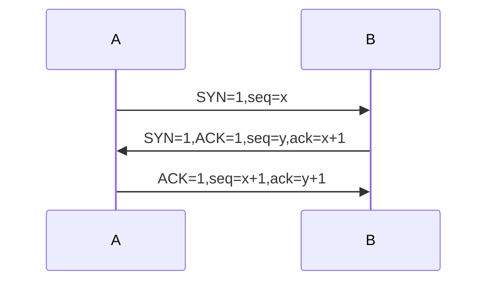
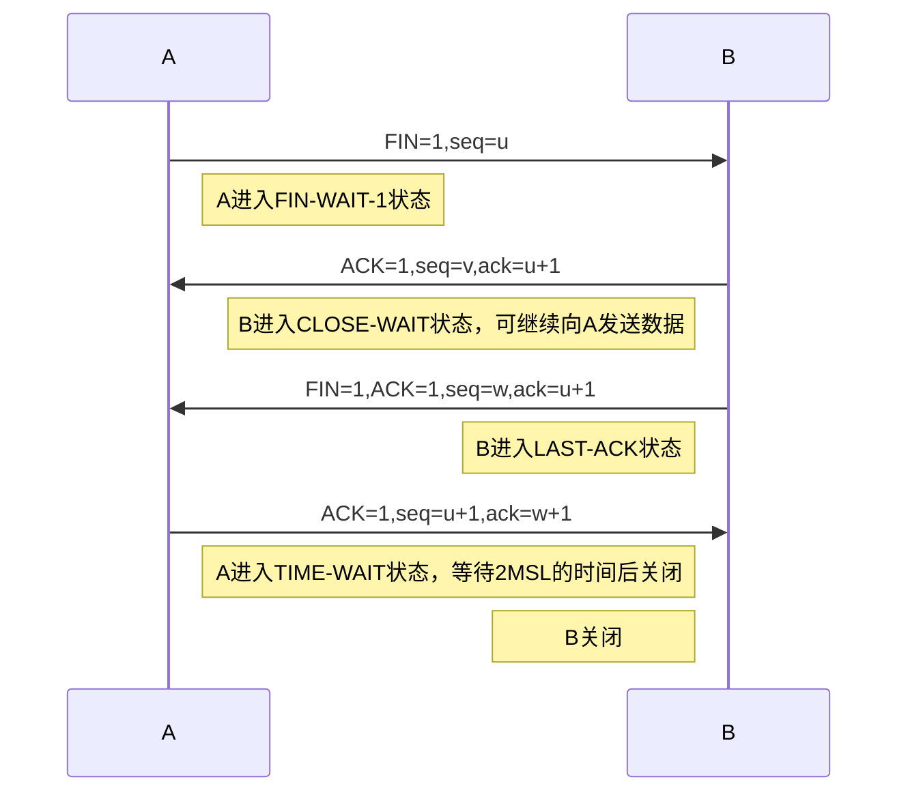

# 计算机网络

[TOC]

## 概述

### 互联网概述

- 计算机网络由若干结点和连接这些节点的链路组成，网络中的节点可以是计算机、集线器、交换机或路由器等；
- 计算机之间通信，即主机之间的进程的通信，通常有两大类通信方式：1.客户端-服务器方式；2.对等连接方式（peer-to-peer）；

### 互联网的组成

#### 互联网的核心部分

在网络核心中起特殊作用的是路由器，路由器是实现分组交换（packet switching）的关键构件，其任务是转发收到的分组，这是网络核心部分最重要的功能；

**电路交换的特点**

- 必须经过建立连接（占用通信资源）——>通话（一直占用通信资源）——>释放连接（归还通信资源）三个步骤的交换方式称为电路交换，电路交换的重要特点就是在通话的全部时间内，通话的两个用户始终占用端到端的通信资源；
- 当使用电路交换来传送计算机数据时，其线路的传输效率往往很低，这是因为计算机数据是突发式地出现在传输线路上的，因此线路上真正用来传送数据的时间往往不到10%甚至1%；

**分组交换的主要特点**

- 采用存储转发技术，把一个报文划分为几个分组后再进行传送；
- 通常我们把要发送的整块数据称为一个报文（message），在发送报文前，先把较长的报文划分为一个个更小的等长数据段，在每个数据段前面，加上一些必要的控制信息组成的首部（header）后，就构成了一个分组（packet）。分组又被称为包，分组的首部被称为包头；

**优点**

- 高效：在传输的过程中动态分配传输带宽，对通信链路是逐段占用；
- 灵活：为每个分组独立选择最合适的转发路由；
- 迅速：以分组作为传送单位，可以不先建立连接就能向其他主机发送分组；
- 可靠：可靠的网络协议；

**缺点**

- 分组在各路由器存储转发时需要排队，会造成一定的时延；
- 分组交换不像线路交换那样通过建立连接来保证所需的资源，因此无法确保通信时端到端所需的带宽；
- 各分组携带的控制信息也造成了一定的开销；

### 计算机网络的性能

#### 计算机网络的性能指标

- 速率：数据的传送速率，也被称为数据率或比特率，单位是bit/s；
- 带宽：计算机网络中，带宽用来表示网络中某通道传送数据的能力，表示单位时间内网络中某信道所能通过的最高数据率；
- 吞吐量：单位时间内通过某个网络的实际的数量量；
- 时延：数据从网络的一段传送到另一端所需的时间；

### 计算机网络体系结构

#### 具有五层协议的体系结构

**应用层**

- 包含了OSI七层体系结构的应用层、表示层和会话层；
- 任务是通过应用进程间的交互来完成特定网络应用，它定义的是应用进程间通信和交互的规则；
- 应用层交互的数据单元称为报文；
- 常见协议有DNS、HTTP、SMTP等；

**运输层**

- 负责向两台主机中进程之间的通信提供通用的数据传输服务；
- 传输控制协议TCP（Transmission Control Protocol）——提供面向连接的、可靠的数据传输服务，其数据传输的单位是报文段（segment）；
- 用户数据报协议UDP（User Datagram Protocol）——提供无连接的、尽最大努力的数据传输服务（不保证数据传输的可靠性），其数据传输的单位是用户数据报；

**网络层**

负责为分组交换网上的不同主机提供通信服务；

**数据链路层**

两台主机之间的数据传输，总是在一段一段的链路上传送的，这就需要使用专门的链路层协议；

**物理层**

在物理层上所传数据的单位是比特，发送方发送1时，接收方应当收到1而不是0，因此物理层需要考虑用多大的电压代表1或0，以及接收方如何识别出发送方所发送的比特；

## 物理层

### 物理层的基本概念

物理层的主要任务描述为确定与传输媒体的接口有关的一些特性：

- 机械特性：指明接口所用的接线器的形状和尺寸、引脚数目和排列、固定和锁定装置等；
- 电气特性：指明在接口电缆的各条线上出现的电压的范围；
- 功能特性：指明某条线上出现的某一电平的电压的意义；
- 过程特性：指明对于不同功能的各种可能事件的出现顺序；

此外，由于数据在计算机内部多采用并行传输方式，但数据在通信线路上的传输方式一般都是串行传输，因此物理层还需要完成传输方式的转换；

### 数据通信的基础知识

#### 数据通信系统的模型

- 一个数据通信系统可以划分为三大部分，即源系统（或发送端、发送方）、传输系统（或传输网络）和目的系统（或接收端、接收方）；
- 源系统一般包括源点（源点设备产生要传输的数据）和发送器（通常源点产生的数字比特流要通过发送器编码后才能够在传输系统中进行传输）；
- 目的系统一般包括接收器（接收传输系统传送过来的信息，将其转换为能够被目的设备处理的信息）和终点（从接收器获取传送来的数字比特流，然后把信息输出）；

**常用术语**

- 通信的目的是传送**消息**（message），**数据**（data）是运送消息的实体，**信号**（signal）则是数据的电气或电磁的表现；
- 模拟信号：代表消息的参数的取值是连续的；
- 数字信号：代表消息的参数的取值是离散的；

#### 有关信道（channel）的几个基本概念

- 单向通信，又称单工通信，即只能有一个方向的通信而没有反方向的交互；
- 双向交替通信，又称半双工通信，即通信的双方都可以发送消息，但不能双方同时发送；
- 双向同时通信，又称全双工通信，即通信的双方可以同时发送和接收消息；

来自信源的信号常称为**基带信号**。基带信号往往包含较多的低频成分，甚至有直流成分，而许多信道并不能传输这种低频分量或直流分量，因此必须对基带信号进行**调制**；

调制可分为两大类，一类是仅仅对基带信号的波形进行变换，使它能够与信道特性相适应，变换后的信号仍然是基带信号，这类调制称为基带调制，或被称为编码。另一类是使用**载波**进行调制，把基带信号的频率搬移到较高的频段，并转换为模拟信号，这种调制被称为带通调制。带通调制可分为**调幅（AM）**、**调频（FM）**和**调相（PM）**；

## 数据链路层

数据链路层主要有两种类型：一对一的点对点通信方式和一对多的广播通信方式；

### 使用点对点信道的数据链路层

#### 数据链路和帧

- 数据链路：当需要在一条线路上传送数据时，除了必须有一条物理线路外，还必须有一些必要的通信协议来控制这些数据的传输，若把实现这些的硬件和软件加到链路上，就构成数据链路。现在最常用的方式是使用网络适配器来实现这些协议，一般的适配器都包括了数据链路层和物理层这两层的功能；
- 帧：点对点信道的数据链路层的协议数据单元。在互联网中，网络层协议数据单元就是IP数据报（或分组或包）；

#### 三个基本问题

**封装成帧**

- 就是在一段数据的前后分别添加首部和尾部，构成一个帧，每一种链路层协议都规定了所能传送的帧的数据部分长度上线——最大传送单元MTU（Maximum Transfer Unit）；
- 帧的首部和尾部的一个重要作用就是进行帧定界，此外还包括很多必要的控制信息；
- 当数据是由可打印的ASCII码组成的文本文件时，帧定界可以使用特殊的帧定界符（SOH和EOT），假定发送端在尚未发送完一个帧时突然出故障，接收顿可根据帧定界符丢弃不完整的帧；

**透明传输**

- 当传送的帧是用本文文件组成的帧时，其数据部分不会出现像SOH或EOT这样帧定界符，这样的传输就是透明传输；
- 如果数据部分是非ASCII码的文本文件时，如果数据中某个字节的二进制码恰好和SOH或EOT一样，数据链路层就会错误地“找到帧地边界”，出现丢数据的问题。为了解决这个问题，数据链路层回在数据中出现控制字符的前面插入一个转移字符ESC；

**差错检测**

- 比特在传输的过程中可能会产生差错，1可能变成0，0可能变为1，这就是比特差错；
- 传输错误的比特占所传输比特的比率称为误码率，为了保证数据传输的可靠性，数据链路层广泛使用了循环冗余检测CRC（Cyclic Redundancy Check）的检错技术；

### 点对点协议PPP（Point-to-Point Protocol）

点对点协议PPP是目前使用得最广泛得数据链路层协议；

#### PPP协议的特点

**PPP协议应满足的需求**

- 简单；
- 封装成帧；
- 透明性；
- 多种网络层协议；
- 多种类型链路；
- 差错检测；
- 检测连接状态；
- 最大传送单元；
- 网络层地址协商；
- 数据压缩协商；

在TCP/IP协议族中，可靠传输由运输层的TCP协议负责，因此数据链路层的PPP协议不需要进行纠错，不需要设置序号，也不需要进行流量控制。此外，PPP协议只支持全双工链路；

**PPP协议的组成**

- 一个将IP数据报封装到串行链路的方式；
- 一个用来建立、配置和测试数据链路连接的链路控制协议；
- 一套网络控制协议NCP；

### 使用广播信道的数据链路层

广播信道可以进行一对多的通信，局域网使用的就是广播信道；

#### 局域网的数据链路层

局域网最主要的特点是：网络为一个单位所拥有，且地理范围和站点数目均有限。其主要优点为：

- 具有广播功能，从一个站点可以很方便地访问全网，局域网上的主机可共享连接在局域网上的各种硬件和软件资源；
- 便于系统的扩展和逐渐演变，各设备的位置可灵活调整和改变；
- 提高了系统的可靠性、可用性和生存性；

以太网是指符合DIX Ethernet V2标准的局域网；

**适配器的作用**

- 计算机与外界局域网的连接是通过通信适配器进行的。适配器和局域网之间的通信是通过电缆或双绞线以串行传输方式进行的，而适配器和计算机之间的通信则是通过计算机主板上的I/O总线以并行传输方式进行的。因此适配器的一个重要功能就是进行数据串行传输和并行传输的转换；
- 适配器在接收和发送各种帧时，不使用计算机的CPU，当适配器收到有差错的帧时，就把这个帧直接丢弃而不必通知计算机。当计算机收到正确的帧时，它就使用中断来通知该计算机，并交付协议栈中的网络层。当计算机要发送IP数据报时，就由协议栈把IP数据报向下交给适配器，组装成帧后发送到局域网；

#### 以太网的MAC层

**MAC层的硬件地址**

在局域网中，硬件地址又称为物理地址或MAC地址，IEEE 802标准为局域网规定了一种48位的全球地址，是指局域网上的每一台计算机中固化在适配器的ROM中的地址；

**MAC帧的格式**

由五个字段组成，前两个字段分别为6字节长的目的地址和源地址字段。第三个字段是2字节的类型字段，用来标志上一层使用的是什么协议。第四个字段是数据字段，其长度在46-1500字节之间，最后一个字段是4字节的帧检验序列FCS（使用CRC检验）；

## 网络层

### 网络层提供的两种服务

网络层向上只提供简单灵活的、无连接的、尽最大努力交付的数据报（即分组）服务；

### 网际协议IP

#### 分类的IP地址

整个的互联网就是一个单一的、抽象的网络，IP地址就是给互联网上的每一台主机或路由器的每一个接口分配一个在全世界范围内是唯一的32位的标识符；

IP地址的编址方式经历了三个阶段：

- 分类的IP地址：最基本的编制方法，将IP地址划分为若干个类，每一类地址都由两个固定长度的字段组成，其中第一个字段是网络号（net-id），它标志主机所连接的网络，一个网络号在整个互联网内必须是唯一的。第二个字段是主机号（host-id），它标志该主机，一台主机号在它前面的网络号所指明的网络范围必须是唯一的；
- 子网的划分：对最基本的编址方法的改进；
- 构成超网：比较新的无分类编址方法；

**IP地址的特点**

- 每一个IP地址都由网络号和主机号两部分组成，IP地址是一种分等级的地址结构。分等级的好处是：1.IP地址管理机构在分配IP地址时只分配网络号，剩下的由得到该网络号的单位自行分配，方便了IP地址管理。2.路由器仅根据目的主机所连接的网络号来转发分组（而不考虑目的主机号），这样使路由表中的项目数大幅度减少。从而减小了路由表所占的存储空间以及查找路由表的时间；
- 实际上IP地址是标志一台主机或路由器和一条链路的接口，当主机同时连接到两个网络上时，该主机就必须同时具有两个相应的IP地址；
- 按照互联网的观点，一个网络是指具有网络号net-id的主机的集合，因此，用转发器或网桥连接起来的若干个局域网仍为一个网络。具有不同网络号的若干个局域网必须使用路由器进行互联；
- 在IP地址中，所有分配到网络号的网络都是平等的，即互联网同等对待每一个IP地址；

#### IP地址与硬件地址

- 物理地址是数据链路层和物理层使用的地址，而IP地址是网络和以上各层使用的地址，是一种逻辑地址；
- 在发送数据时，数据从高层下到低层，然后才到通信链路上传输，使用IP地址的IP数据报一旦交给了数据链路层，就被封装成MAC帧，MAC帧在传送时使用的源地址和目的地址都是硬件地址，这两个硬件地址都写在MAC帧的首部中；
- 反过来在连接通信链路上的设备收到MAC帧时，根据MAC帧首部中的硬件地址决定收下或丢弃，然后剥去MAC帧的首部和尾部后把MAC层的数据上交给网络层，网络层才能在IP数据报的首部中找到源IP地址和目的IP地址；

#### 地址解析协议ARP

- ARP协议用于通过一个机器的IP地址找到其相应的硬件地址；
- 由于全世界存在各式各样的网络，它们使用不同的硬件地址，要使这些异构网络能够互相通信就必须进行非常复杂的硬件地址转换工作，由用户或用户主机来完成这项工作几乎是不可能的，但IP地址把这个复杂问题解决了；

#### IP数据报的格式

一个IP数据由首部和数据两部分组成，首部的前一部分是固定长度，共20字节，后面是可选字段，其长度是可变的；

##### 首部中固定部分中的各字段

- 版本：IP协议的版本，占4位；
- 首部长度：占4位，首部长度字段所表示数的单位是32位字（4字节），因此首部长度限制为60字节；
- 区分服务：占8位，用来获得更好的服务，旧标准中叫做服务类型；
- 总长度：指首部和数据之和的长度，单位为字节，总长度字段为16位，因为数据报的最大长度为power(2, 16) - 1 = 65535字节；

在IP层下面的每一种数据链路层协议都规定了一个数据帧中的数据字段的最大长度，这被称为最大传送单位MTU（Maximum Transfer Unit），当一个IP数据报封装成链路层的帧时，此数据报的总长度一定不能超过下面的数据链路层所规定的MTU值。最常用的以太网规定的MTU值为1500字节。如果所传送的数据报长度超过数据链路层的MTU值，就必须把过长的数据报进行分片处理，在进行分片时，数据报首部中的总长度字段是指分片后每一个分片的首部长度与该分片的数据长度的总和；

- 标识（identification）：占16位，IP软件在存储器中维持一个计数器，每产生一个数据报，计数器就加1，并将此值此值赋给标识字段；
- 标志（flag）：占3位，只有两位有意义，最低位即为MF，表示后面是否还有分片，中间一位计为DF，表示是否允许分片；
- 片偏移：占13位，片偏移指出，较长的分组在分片后，某片在原分组中的相对位置；
- 生存时间，占8位，即TTL（Time To Live），表明数据报在网络中的寿命，单位最初为秒，随着技术的进步在不断缩短；
- 协议：，占8位，协议指出此数据报携带的数据是使用何种协议，以便目的主机IP层知道应将数据部分上交给哪个协议进行处理；
- 首部校验和，占16位，只校验数据报的首部，不包括数据部分，接收方通过此字段进行运算，从而判断数据报是否发生过变化；
- 源地址：占32位；
- 目的地址：占32位

##### IP数据报首部的可变部分

用来支持排错、测量以及安全等措施；

### 划分子网和构造超网

#### 划分子网

两级IP地址不合理的点：

- IP地址空间的利用率有时很低；
- 给每一个物理网络分配一个网络号会使路由表变得太大因而使网络性能变坏；
- 两级IP地址不够灵活；

划分子网的基本思路：

- 一个拥有许多物理网络的单位，可将所属的物理网络划分为若干个子网，但是这个单位对外仍然表现为一个网络；
- 划分子网的方法是从网络的主机号借用若干位作为子网号，当然主机号也就相应减少了同样的位数，两级IP地址在本单位内部变为三级IP地址，记为{网络号, 子网号, 主机号}；
- 凡是从其他网络发送给本单位某台主机的IP数据报，仍然是根据IP数据报的目的网络号找到连接在本单位网络上的路由器，但此路由器在收到IP数据报后，再按目的网络号和子网号找到目的子网，把IP数据报交付目的主机；

**子网掩码**

从IP数据报的首部无法看出源主机或目的主机所连接的网络是否进行子网的划分，这个时候就需要用到子网掩码，不管网络有没有划分子网，只要把子网验码和IP地址进行逐位的与运算，就能立即得出网络地址；

### 虚拟专用网VPN和网络地址转换NAT

#### 虚拟专用网VPN

- 在许多情况下，很多主机主要还是和主机构内的其他主机进行通信，并不都需要和互联网相连，对于这些仅在机构内部使用的计算机就可以由本机构自行分配其IP地址，即让这些计算机使用仅在本机构有效的IP地址；
- RFC 1918指明了一些专用地址，它们只用于一个机构的内部通信，而不能用于和互联网的主机通信。在互联网的所有路由器，对目的地址是专用地址的数据报一律不进行转发；
- 采用这样的专用IP地址的互连网络称为专用网络或本地互联网或专用网；
- 有时一个很大的机构的许多部分分布的范围很广，这些部门经常要互相交换信息，这时就可以利用公用的互联网作为本机构各专用网之间的通信载体，这样的专用网又称为虚拟专用网VPN（Virtual Private Network）；

#### 网络地址转换NAT

网络地址转换NAT（Network Address Translation），这种方法需要在专用网连接到互联网的路由器上安装NAT软件，装有NAT软件的路由器叫作NAT路由器，它至少有一个有效的外部全球IP地址。这样所有使用本地地址的主机在和外界通信时，都要在NAT路由器上将其本地地址转换成全球IP地址，才能和互联网连接；

## 运输层

### 运输层协议概述

#### 进程之间的通信

IP协议虽然能把分组送到目的主机，但是这个分组还停留在主机的网络层而没有交付主机中的应用进程。从运输层的角度看，通信的真正端点并不是主机而是主机中的进程，也就是说，端到端的通信是应用进程之间的通信；

#### 运输层的端口

- 应用层的所有应用进程都可以通过运输层再传送到IP层，这就是复用，运输层从IP层收到发送给各应用进程的数据后，必须分别交付指明的各应用进程，这就是分用；
- 显然，给应用层的每个应用进程赋予一个非常明确的标志是至关重要的，解决这个问题的办法就是在运输层使用协议端口号（protocol port number），或通常简称为端口（这里的端口是指应用层的各种协议进程与运输实体进行层间交互的一种地址）；
- TCP/IP的运输层用一个16位的端口号来标志一个端口，16位的端口号可允许有65535个不同的端口号；
- 由此可见，两个计算机中的进程要互相通信，不仅必须知道对方的IP地址，而且要知道对方的端口号；

### 用户数据报协议UDP

#### UDP概述

用户数据报协议UDP只在IP的数据报服务之上增加了很少的功能——复用和分用的功能以及差错检测的功能。

UDP的主要特点是：

- UDP是无连接的，发送数据之前不需要建立连接，因此减少了开销和发送数据之前的时延；
- UDP使用尽最大努力交付，即不保证可靠交付，因此主机不需要维持复杂的连接状态表；
- UDP是面向报文的。发送方的UDP对应用程序交下来的报文，在添加首部后就向下交付IP层，UDP对应用层交下来的报文，既不合并，也不拆分，而是保留这些报文的边界；
- UDP没有拥塞控制，因此网络出现的拥塞不会使源主机的发送速率降低，这对于某些实时应用是很重要的。很多实时应用要求源主机以恒定的速率发送数据，并且允许在网络发生拥塞时丢失一些数据，但却不允许数据有太大的时延，UDP正好适合这种要求；
- UDP的首部开销小，只有8个字节；

#### UDP的首部格式

用户数据报UDP的首部由四个字段组成，每个字段的长度都是两个字节，各字段意义如下：

- **源端口**：源端口号，在需要对方回信时选用，不需要时可以全0；
- **目的端口**：目的端口号，这在终点交付报文时必须使用。当运输层从IP层收到UDP数据报时，就根据首部中的目的端口，把UDP数据报通过相应的端口，上交最后的终点——应用进程；
- **长度**：UDP用户数据报的长度，其最小值是8；
- **校验和**：检验UDP用户数据报在传输中是否有错，有错就丢弃；

虽然在UDP之间的通信要用其端口号，但由于UDP的通信是无连接的，因此不需要使用套接字（TCP之间的通信必须要在两个套接字之间建立连接）；

UDP在计算检验和时，要在UDP用户数据报前增加12个字节的伪首部，它仅用于计算校验和，既不向下传送也不向上递交；

### 传输控制协议TCP概述

#### TCP最主要的特点

TCP是面向连接的运输层协议，应用层序在使用TCP协议之前，必须先建立TCP连接，在传送数据完毕后，必须释放已经建立的TCP连接；

- 每一条TCP连接只能有两个端点（endpoint），每一条TCP连接只能是点对点的；
- TCP提供可靠交付的服务，通过TCP连接传送的数据，无差错、不丢失、不重复，并且按序到达；
- TCP提供全双工通信，允许通信双方的应用进程在任何适合都能发送数据。TCP连接的两端都设有发送缓存和接收缓存，用来临时存放双向通信的数据；
- 面向字节流，TCP中的流指的是流入到进程或从进程流出的字节序列。面向字节流的含义是：虽然应用程序和TCP的交互是一次一个数据块，但TCP把应用程序交下来的数据仅仅看成是一连串的无结构的字节流。TCP并不知道所传送的字节流的含义，TCP不保证接收方应用程序所收到的数据块和发送方应用程序所发出的数据库具有对应大小的关系；

TCP并不关心应用程序一次把多长的报文发送到TCP缓存中，而是根据对方给出的窗口值和当前网络拥塞的程度来决定一个报文段应包含多少个字节（UDP发送的报文长度是应用程序给出的），如果应用进程传送到TCP缓存的数据块太长，TCP就可以把它划分短一些再传送，如果应用进程一次只发来一个字节，TCP可以等待积累有足够多的字节后再构成报文段发送出去；

#### TCP的连接

TCP把连接作为最基本的抽象。TCP连接的端点是套接字Socket，端口号拼接到IP地址即构成了套接字。每一条TCP连接唯一地被通信两端的两个端点（即两个套接字）所确定：

TCP连接 = {socket1, socket2} = {(IP1, port1), (IP2, port2)}

同一个IP地址可以有多个不同的TCP连接，同一个端口号也可以出现在多个不同的TCP连接中；

### 可靠传输的工作原理

#### 停止等待协议

运输层并不使用这种协议，实际使用的协议比停止等待协议复杂得多；

“停止等待”就是每发送完一个分组就停止发送，等待对方得确认，在收到确认后再发送下一个分组；

**自动重传请求（ARQ，Automatic Repeat reQuest）**

- **超时重传**：发送方只要超过一段时间没有收到确认，就认为刚才发送的分组丢失了，因而重传前面发送过的分组；
- **确认丢失**：接收方收到了发送方的分组，但是确认的报文丢失了，此时接收方会重传报文，确认方应该丢弃这个重复的报文，并向发送方回复确认；
- **确认迟到**：发送方收到回复时已超时，则对于重复的确认，发送方需要丢弃，接收方也应该丢弃重复发送的报文；

停止等待协议的优点是简单，缺点是信道利用率太低；

#### 连续ARQ协议

- 发送方维持一个发送窗口，窗口内的5个分组都可连续发送出去，而不需要等待对方的确认；
- 连续ARQ协议规定，发送方每收到一个确认，就把发送窗口向前滑动一个分组的位置；
- 接收方一般采用累积确认的方式，接收方不必对收到的分组逐个发送确认，而是在收到几个分组后，对按序到达的最后一个分组发送确认，这表示到这个分组为止的所有分组都已正确收到了；

### TCP报文段的首部格式

TCP虽然是面向字节流的，但TCP传送的数据单元却是报文段，一个TCP报文段分为首部和数据两部分，而TCP的全部功能都体现在它首部中各字段的作用。

TCP报文段首部的前20个字节是固定的，各字段意义如下：

- **源端口和目的端口**：各占2个字节，分别写入端口号和目的端口号，与UDP相似，TCP的分用功能也是通过端口实现的；
- **序号**：占4个字节，共32位，所以共有power(2, 32)个序号，序号使用mod(power(2, 32))运算。在TCP连接中传送的字节流的每一个字节都按顺序编号，整个要传送的字节流的起始序号必须在连接建立时设置，首部中的序号字段值则指的是本报文段所发送的数据的第一个字节的序号；
- **确认号**：占4个字节，是期望收到对方下一个报文段的第一个数据字节的序号。若确认号为N，则表明到序号N-1为止的所有数据都已正确收到；
- **数据偏移**：占4位，它指出TCP报文段的数据起始处距离TCP报文段起始处有多远，即TCP报文段的首部长度；
- **保留**：占6位，保留为今后使用，目前置为0；
- **紧急URG（URGent）**：当URG=1时，表明紧急指针字段有效，它告诉系统此报文段中有紧急数据，应尽快传送。发送方TCP会把紧急数据插入到本报文段数据的最前面，这时要与首部中紧急指针字段配合使用；
- **确认ACK（ACKnowledgment）**：仅当ACK=1时确认号字段才有效，TCP规定，在连接建立后所有传送的报文段都必须把ACK置1；
- **推送PSH**：当两个应用进程进行交互式通信时，有时在一段的应用进程希望在键入一个命令后立即就能收到对方的响应，这种情况下就可以使用push操作；
- **复位RST**：当RST=1时，表明TCP连接中出现严重差错，必须释放连接，然后重新建连接，还用来拒绝一个非法的报文段或拒绝打开一个连接；
- **同步SYN**：在连接建立时用来同步序号，当SYN=1而ACK=0时，表明这是一个连接请求报文段，若对方同意建立连接，则应在响应的报文段中使用SYN=1和ACK=1。因此，SYN置1就表示这是一个连接请求或连接接受报文；
- **终止FIN**：用来释放一个连接，当FIN=1时，表明此报文段的发送方的数据已发送完毕，并要求释放运输连接；
- **窗口**：占2个字节，窗口指的是发送本报文段的一方的接收窗口（而不是自己的窗口），窗口值告诉对方，从本报文首部中的确认号算起，接收方目前允许对方发送的数据量，即窗口值作为接收方让发送方设置其发送窗口的依据。窗口字段明确指出了现在允许对方发送的数据量，窗口值经常在动态变化着；
- **校验和**：占2个字节，和UDP一样，计算校验和时要在前面加上12字节的伪首部；
- **紧急指针**：占2字节，在URG=1时才有意义，它指出本报文段中的紧急数据的字节数，即使窗口值为0时也可发送紧急数据；
- **选项**：长度可变，最长可达40字节。TCP最初只规定了一种选项，即最大报文段长度MSS（Maximum Segment Size），它是指每一个TCP报文段中的数据字段的最大长度。MSS应尽可能大些，只要在IP层传输时不需要再分片就行。随着互联网的发展，又陆续增加了几个选项，如窗口扩大选项、时间戳选项、选择确认选项；

### TCP可靠传输的实现

#### 以字节为单位的滑动窗口

假定数据传输只在一个方向进行，即A发送数据，B给出确认，则有：

- A收到B发来的确认报文段时，根据确认报文的确认号和窗口值，即可构造除A自己的发送窗口；

- 发送窗口表示，在没有收到B的确认的情况下，A可以连续把窗口内的数据都发送出去，凡是已经发送过的数据，在未收到确认之前都必须暂时保留，以便在超时重传时使用；

- 发送窗口的后沿的后面部分表示已发送且已收到了确认，这些数据显然不需要再保留，而发送窗口前沿的前面部分表示不允许发送的，因为接收方都没有为这部分数据保留临时存放的缓存空间；

- 发送窗口的位置由窗口后延和前沿的位置共同确定。后沿可能不动（没有收到新的确认）或前移（收到了新的确认）。前沿通常是向前移动，但也有可能不动（没有收到新的确认，或收到了新的确认，但是对方通知的窗口大小缩小了）。也可能向后收缩，但是TCP标准强烈不赞成这样做，因为很可能窗口缩小的那一部分数据已经发送出去了，这样会产生一些错误；

需要强调的点：

- A的发送窗口是根据B的接收窗口设置的，但是再同一时刻，两者不一定一样大，因为传送窗口值有时间滞后，且发送方可能因为网络的拥塞情况适当减小自己的发送窗口的数值；
- 对于不按序到达的数据如何处理，TCP标准没有明确规定。通常对不按序到达的数据是先临时存放在接收窗口中，等到字节流中所缺少的字节收到后，再按序交付上层的应用进程；
- TCP要求接收方必须有累积确认的功能，这样可以减小传输开销。接收方可以在合适的时候发送确认，也可以在自己有数据要发送时把确认信息顺便捎带上。但是接收方不应过分推迟确认请求，TCP标准规定确认推迟的时间不应超过0.5秒；

#### 超时重传时间的选择

- TCP的发送方在规定的时间内没有收到确认就要重传已发送的报文段。这种重传的概念是很简单的，但是重传时间的选择却是TCP最复杂的问题之一；
- 如果把超时重传时间设置得太短，就会引起很多报文段的不必要的重传，使网络负荷增加。但若把超时重传时间设置得过长，则又使网络空闲时间增加，降低了传输效率；
- TCP采用了一种自适应算法，它记录一个报文段发出得时间，以及收到相应得确认的时间，这两个时间之差就是**报文段的往返时间RTT**。TCP保留了RTT的一个加权平均往返时间RTTs，每测量到一个新的RTT样本，就按照下式重新计算一次RTTs：新RTTs = (1 - a) * 旧RTTs + a * 新的RTTs样本；
- 超时计算器设置的超时重传时间RTO（Retransmission Time-Out）应略大于RTTs，RFC6298建议使用下式计算RTO：RTO = RTTs + 4 * RTTd，RTTd是RTT的偏差的加权平均值；
- 如何判断确认报文段是对先发送的报文段的确认，还是对后来重传的报文段的确认？Karn算法：计算加权平均RTTs时，只要报文段重传了，就不采用其往返时间样本，这样得出的加权平均RTTs和RTO就较准确。对Karn算法的修正：发生重传时则把重传时间设置为旧重传时间的2倍，当不再发生重传时，才使用标准的超时重传时间计算法；

#### 选择确认SACK

- 若收到的报文段无差错，只是未按序号，中间还缺少一些序号的数据，那么能够设法只传送缺少的数据而不重传以及正确到达接收方的数据？选择确实就是一种实现方法；
- 如果要使用SACK，那么在建立TCP连接时，就要在TCP首部的选项中加入“允许SACK”选项，双方必须都实现商定好。如果使用SACK，则需要在TCP报文段的首部中增加SACK选项，以便报告收到的不连续的字节块的边界；

### TCP的流量控制

#### 利用滑动窗口实现流量控制

- 流量控制就是让发送方的发送速率不要太快，要让接收方来得及接收。发送方的发送窗口不能超过接收方给出的接收窗口的数值，单位为字节；
- 如果B向A发送了零窗口的报文段后不久，B的接收缓存又有了一些存储空间，于是B向A发送接收窗口非0的通知，此时如果这个报文段在传送过程中丢失，则A一直等待收到B的非0窗口通知，B一直等待A发送的数据，造成死锁。为了解决这个问题，TCP为每一个连接设有一个持续计时器，只要TCP连接的一方收到对方的零窗口通知，就启动持续计时器，若持续计时器设置的时间到期，就发送一个零窗口的探测报文段，而对方就在确认这个探测报文段时给出了现在的窗口值；

#### TCP的传输效率

可以使用不同的机制来控制TCP报文段的发送时机：

- 机制一：TCP维持一个变量，它等于最大报文段长度MSS，只要缓存中存放的数据达到MSS字节时，就组装成一个TCP报文段发送出去；
- 机制二：由发送方的应用进程明确指明要求发送报文段，即TCP支持的推送（push）操作；
- 机制三：发送方的一个计时器期限到了，这时就把当前已有的缓存数据装入报文段（但长度不能超过MSS）发送出去；

在TCP的实现中广泛使用Nagle算法：

- 若发送应用进程把要发送的数据逐个字节地送到TCP的发送缓存，则发送方就把**第一个数据字节先发送出去**，把后面到达的数据字节都缓存起来。当发送方收到对第一个数据字符的确认后，**再把发送缓存中的所有数据组装成一个报文段发送出去**，同时继续对随后到达的数据进行缓存。**只有在收到对前一个报文段的确认后才继续发送下一个报文段**。
- Nagle算法还规定：当到达的数据已达到发送窗口大小的一半或已达到报文段的最大长度时，就立即发送一个报文段，这样就可以有效地提高网络的吞吐量；

**糊涂窗口综合征**：

- TCP接收方缓存已满时，交互式的应用进程一次只从接收缓存中读取一个字节，发送方一次也只能发送1个字节，这样进行下去，网络效率很低；
- 要解决这个问题，可以让接收方等待一段时间，使得或者接收缓存已有足够空间容纳一个最长的报文段，或者等到接收缓存已有一半空闲的空间。满足任一条件，接收方就发出确认报文，并向发送方通知当前的窗口大小。此外，发送方也不用发送太小的报文段，而是把数据积累成足够大的报文段，或达到接收方缓存的空间的一半大小；

### TCP的拥塞控制

#### 拥塞控制的一般原理

- 在计算机网络中的链路容量（即带宽）、交换结点中的缓存和处理机等，都是网络资源。在某段时间，若对网络中某一资源的需求超过了该资源所能提供的可用部分，网络的性能就要变坏，这种情况叫作拥塞；
- 发生拥塞时不能仅靠增加部分资源来解决，仅增加部分资源可能会导致性能瓶颈被转移到其他地方，甚至导致更严重的后果；
- 拥塞控制就是防止过多的数据注入到网络中，这样可以使网络中的路由器或链路不致过载；
- 拥塞控制是一个全局性的过程，涉及到所有的主机、所有的路由器，以及与网络传输性能有关的所有因素。但TCP连接的端点只要迟迟不能收到对方的确认信息，就猜想在当前网络中的某处可能发生了拥塞；
- 拥塞控制很难设计，因为它是一个动态的问题。拥塞控制可以分为开环控制和闭环控制两种方法。开环控制就是在设计网络时事先将有关发生拥塞的因素考虑周到，力求网络在工作时不产生拥塞，但一旦整个系统运行起来，就不再中途进行改正了。闭环控制是基于反馈环路的概念，主要有以下几种措施：1.监测网络系统以便检测到拥塞在何时、何处发生；2.把拥塞发生的信息传送到可采用行动的地方；3.调整网络系统的运行以解决出现的问题；

#### TCP的拥塞控制方法

TCP进行拥塞控制的算法有四种，即**慢开始（slow-start）**、**拥塞避免（congestion avoidance）**、**快重传（fast retransmit）**和**快恢复（fast recovery）**；

- 基于窗口的拥塞控制，发送方维持一个叫做拥塞窗口cwnd（congestion window）的状态变量，拥塞窗口的大小取决于网络的拥塞程度，并且动态地在变化。发送方让自己的发送窗口等于拥塞窗口；
- 发送方控制拥塞窗口的原则是：只要网络没有出现拥塞，拥塞窗口就可以再增大一些，以便把更多的分组发送出去，这样就可以提高网络的利用率。但只要网络出现拥塞或有可能出现拥塞，就必须把拥塞窗口减小一些， 以减少注入到网络中的分组数，以便缓解网络可能出现的拥塞；
- 发送方如何知道网络发生了拥塞？当发生网络拥塞时，路由器会丢弃分组，因此只要发送方没有按时收到应当到达的确认报文，也就是出现了**超时**，就可以猜想网络可能出现了拥塞；

**慢开始**

- 慢开始算法的思路：由小到大逐渐增大发送窗口，也就是由小到大逐渐增大拥塞窗口数值。在刚刚开始发送报文段时，先把初始拥塞窗口cwnd设置为2-4个发送方的最大报文段SMSS（Sender Maximum Segment Size）的数值，在每收到一个对新的报文段的确认后，可以把拥塞窗口增加最多一个SMSS的数值；
- 为了防止拥塞窗口cwnd增长过大引起网络拥塞，还需要设置一个慢开始门限ssthresh状态变量，当cwnd > ssthresh时，开始改用拥塞避免算法；

**拥塞避免**

拥塞避免算法的思路是让拥塞窗口cwnd缓慢地增大，即每经过一个往返时间RTT就把发送方的拥塞窗口cwnd加1；

**快重传**

- 有时个别报文会在网络中丢失，但实际上网络并未发送拥塞，如果发送方迟迟收不到确认，就会产生超时，就会误以为网路发生了拥塞，导致发送方错误地启动慢开始，把拥塞窗口又设置为1，因此降低了传输效率；
- 采用快重传算法可以让发送方尽早知道发生了个别报文段的丢失。快重传算法首先要求接收方不要等待自己发送数据时才进行捎带确认，而是要立即发送确认，即使收到了失序的报文段也要立即发出对已收到的报文段的重复确认；
- 发送方只要一连收到3个重复确认，就知道接收方确实没有收到某报文段，因而应当立即进行重传；

**快恢复**

发送方知道只是丢失了个别的报文段， 于是不启动慢开始，而是执行快恢复算法——调整ssthresh = cwnd / 2，cwnd = ssthresh，并开始执行拥塞避免算法；

#### 主动队列管理AQM

**TCP的拥塞控制与网络层采取的策略有密切的关系**

网络层的策略对TCP拥塞控制影响最大的就是路由器的分组丢弃策略，在最简单的情况下，路由器的队列通常都是按照“先进先出”的规则处理到来的分组。由于队列长度总是有限，因此当队列已满时，以后再到达的所有分组将都被丢弃，这就叫尾部丢弃策略。进而导致发送方出现超时重传，使TCP进入拥塞控制的慢开始状态。如果网络中有很多的TCP连接，它们复用了网络层， 在这种情况下， 若发生路由器中的尾部丢弃，会同时影响到很多条TCP连接，结果使这许多TCP连接在同一时间突然进入慢开始状态，这在TCP的术语中称为全局同步；

**Active Queue Management**

为了避免发生网络中的全局同步现象，提出了主动队列管理AQM。即在路由器的队列长度达到某个值得警惕的数值时，就主动丢弃到达的分组，这样就提醒了发送方放慢发送的速率，因而有可能使网络阻塞的程度减轻；

### TCP的运输连接管理

运输连接有三个阶段，即：连接建立、数据传送和连接释放。在TCP连接建立过程中要解决以下三个问题：

- 要使每一方能够确知对方的存在；
- 要允许上方协商一些参数，如最大窗口值，是否适用窗口扩大选项和时间戳选项以及服务质量等；
- 能够对运输实体资源进行分配；

TCP连接的建立采用客户服务器方式，client发起连接建立，server等待连接建立；

#### TCP连接建立

TCP建立连接的过程叫做握手，握手需要在client和server之间交换三个TCP报文段；

1. A首先创建传输控制模块TCB（Transmission Control Block，存储了每一个连接中的一些重要信息，如TCP连接表，指向发送和接收缓存的指针，指向重传队列的指针等），然后在打算建立TCP连接时，向B发出连接请求报文端，这时首部中的同步位SYN=1，同时选择一个初始序号，此时TCP客户进程（A）进入**SYN-SENT（同步已发送）**状态；
2. B收到请求报文段后，如同意建立连接， 则向A发送确认，在确认报文段中应把SYN位和ACK位都置1，确认号是ack = x + 1，同时也为自己选择一个初始序号seq = y。请注意这个报文段也不能携带数据，但要消耗掉一个序号。这时TCP服务器进程（B）进入**SYN-RCVD（同步收到）**状态；
3. TCP客户进程收到B的确认后，还要向B给出确认。确认报文段的ACK置1，确认号ack = y + 1，而自己的序号seq = x + 1。TCP的标准规定，ACK报文段可以携带数据，但是如果不携带数据则不消耗，在这种情况下，下一个数据报文段的序号仍是seq = x + 1。这时TCP连接已经建立，A进入**ESTABLELISHED（已建立连接）**状态，当B收到A的确认后，也进入ESTABLISHED状态；

**为什么Client最后还要发送一次确认？**

主要是为了防止已失效的连接请求报文段突然又传送到了B，因而产生错误。假定出现这种情况：A发出的第一个连接请求报文在网络结点中长时间滞留，以致延误到连接释放以后的某个时间才到达B。这样A第一次发出的连接请求和重试的连接请求都会创建连接，导致网络资源被浪费（假设没有最后一步的确认）；

**第三次握手失败怎么办？**

服务器（B）并不会重传ack报文，而是直接发送RST报文段，进入CLOSED状态。这样做的目的是为了防止SYN泛洪攻击；

#### TCP的连接释放

数据传输结束后，通信的双方都可释放连接，现在双方都处于ESTABLISHED状态；

1. A的应用进程先向其TCP发出连接释放报文段，并停止再发送数据，主动关闭TCP连接。A把连接释放报文段首部的终止控制位FIN置1，这时A进入**FIN-WAIT-1**状态，等待B的确认；
2. B收到连接释放报文段后即发出确认，确认号是ack=u+1，然后B就进入CLOSE-WAIT状态。TCP服务器进程这时应通知高层应用进程，因而从A到B这个方向的连接就释放了，这时的TCP连接处于**半关闭（half-wait）**状态，即A已经没有数据要发送了，但B若发送数据，A仍要接收。也就是说从B到A的连接并未关闭，这个状态可能会持续一段时间；
3. A收到来自B的确认后，就进入**FIN-WAIT-2**状态，等待B发出的连接释放报文段；
4. 若B已经没有要向A发送的数据，其应用进程就通知TCP释放连接，这时B发出的连接释放报文必须使FIN=1，这时B进入**LAST-ACK**状态，等待A的确认；
5. A在收到B的连接释放报文段后，必须对此发出确认，在确认报文段中把ACK置1，进入到**TIME-WAIT**状态。注意现在TCP连接还没有释放掉，必须经过时间等待计时器（TIME-WAIT timer）设置的时间2MSL（Maximum Segment Lifetime， 最长报文寿命）后，A才进入到CLOSED状态；

**为什么发起断开连接的一方需要进入TIME-WAIT状态并等待2MSL的时间？**

1. 为了**保证A发送的最后一个ACK报文段能够到达B**，这个报文段有可能丢失，因此B在收不到这个确认时，可以重传FIN+ACK的报文段；
2. 防止“已失效的连接请求报文段”出现在本连接中，A在发送完最后一个ACK报文段后，再经过时间2MSL，就可以**使本连接持续的时间内所产生的所有报文段都从网络中消失**，这样就可以使下一个新的连接中不会出现这种旧的连接请求报文段；

TCP还设有一个保活计时器（keepalive timer），服务器每收到一次客户的数据，就重新设置保活计时器，时间的设置通常是两小时，若两小时没有收到客户的数据，服务器就发送一个探测报文段，以后则每隔75秒发送一次，若一连发送10个探测报文段后仍无客户的响应，服务器就仍为客户端出了故障，接着就关闭这个连接；

#### TCP的有限状态机

百度找图吧。。

## 应用层

在运输层协议之上，还需要有应用层协议，因为每个应用层协议都是为了解决某一类应用问题，而问题的解决又必须通过位于不同主机中的多个应用进程之间的通信和协同工作来完成；

应用层协议应当定义：

- 应用进程交换的报文类型，如请求报文和响应报文；
- 各种报文类型的语法，如报文中的各个字段及其详细描述；
- 字段的语义，即包含在字段中的信息的含义；
- 进程何时、如何发送报文，以及对报文进行响应的规则；

### 域名系统DNS

#### 域名系统概述

- 域名系统DNS（Domain Name System）是互联网使用的命名系统，用来把便于人们使用的机器名字转换为IP地址；
- 互联网的域名系统DNS被设计称为一个联机分布式数据库系统，并采用客户服务器方式，DNS使大多数名字都在本地进行解析，仅少量解析需要在互联网上通信，因此DNS系统系统的效率很高；
- 域名到IP地址的解析是由分布在互联网上的许多域名服务器程序共同完成的，域名服务器程序在专设的结点上运行，而人们也常把运行域名服务器程序的机器称为域名服务器；
- 域名到IP地址的解析过程的要点如下：当某一个应用进程需要把主机名解析为IP地址时，该应用进程就调用解析程序，并成为DNS的一个客户，把待解析的域名放在DNS请求报文中，以UDP用户数据报方式发给本地域名服务器。本地域名服务器在查找域名后，把对应的IP地址放在回答报文中返回，应用进程获得目的主机的IP地址后即可进行通信；

#### 互联网的域名结构

- DNS规定，域名中的标号（label）都由英文字母和数字组成，每个标号不超过63个字符，也不区分大小写。标号中除“-”外不能使用其他标点符号，级别级别从左到右按从低到高书匈奴。完整域名不超过255个字符；
- 互联网的名字空间是按照机构的组织来划分的，与物理的网络无关，与IP地址的子网也没有关系；

#### 域名服务器

- 从理论上讲，可以让每一级的域名都有一个相应的域名服务器，使所有的域名服务器构成“域名服务器树”的结构，但这样做会使域名服务器的数量太多，使域名系统运行效率降低，因此DNS就采用划分区的办法来解决这个问题；
- 一个服务器所负责管辖的范围叫做区（zone），在i一个区中的所有节点必须是能够连通的，每一个区设置相应的权限域名服务器，用来保存该区中的所有主机的域名到IP地址的映射。总之，DNS服务器的管辖范围不是以域为单位，而是以区为单位；

根据域名服务器所起的作用，可以把域名服务器划分为四种类型：

- **根域名服务器（root name server）**：最高层次也是最重要的域名服务器，不管是哪一个本地域名服务器，若要对互联网上任何一个域名进行解析，只要自己无法解析，就首先要求助于根域名服务器；
- **顶级域名服务器**：管理该顶级域名服务器注册的所有二级域名，当收到DNS查询请求时，就给出相应的回答；
- **权限域名服务器**：负责一个区的域名服务器；
- **本地域名服务器**：当一台主机发出DNS查询请求时，这个查询请求报文就发送给本地域名服务器；

为了提高DNS查询效率，并减轻根域名的负荷和减少互联网上的DNS查询报文数量，在域名服务器中广泛地使用了告诉缓存。高速缓存用来存放最近查询过的域名以及从何处获得域名映射信息的记录；

### 文件传送协议

#### FTP概述

文件传送协议FTP（File Transport Protocol）是互联网上使用得最广泛得文件传送协议；

#### FTP的基本工作原理

文件传送协议FTP只提供文件传送的一些基本的服务，它使用TCP可靠的运输服务，FTP的主要功能是减少或消除在不同操作系统下处理文件的不兼容性；

FTP使用Client / Server的方式，一个FTP服务器进程可同时为多个客户进程提供服务。FTP的服务器进程由两大部分组成：一个主进程，负责接受新的请求；另外有若干个从属进程，负责处理单个请求；

主进程工作步骤如下：

1. 打开熟知端口（端口号为21），使客户进程能够连接上；
2. 等待客户进程发出连接请求；
3. 启动从属进程处理客户进程发来的请求，从属进程对客户进程的请求处理完毕后即终止，但从属进程在运行期间根据需要还可能创建其他一些子进程；
4. 回到等待状态，继续接受其他客户进程发来的请求，主进程与从属进程的出口是并发进行的；

- 在进行文件传输时，FTP的客户端和服务器之间要建立两个并行的TCP连接：控制连接和数据连接。控制连接在整个会话期间一直保持打开，FTP客户所发出的传送请求，通过控制连接发送给服务器端的控制进程，但控制连接并不用来传送文件。用于传输文件的是数据连接，服务器端的控制进程在接收到FTP客户发送来的文件传输请求后就创建数据传送进程和数据连接，用来连接客户端和服务器端的数据传送进程；
- 使用两个独立的连接的主要好处是使协议更加简单和更容易实现，同时在传输文件时还可以利用控制连接对文件的传输进行控制；

#### 简单文件传送协议TFTP

TCP/IP协议族中还有一个简单文件传送协议TFTP（Trivial File Transfer Protocol），它是一个很小且易于实现的文件传送协议；

TFTP的优点主要有两个：1.TFTP可用于UDP环境；2.TFTP代码所占的内存较小，这对较小的计算机或特殊用途的设备是很重要的；

TFTP的主要特点是：

- 每次传送的数据报文中有512字节，但最后一次可不足512字节；
- 数据报文按序编号，从1开始；
- 支持ASCII码或二进制传送；
- 可对文件进行读或写；
- 使用很简单的首部；

### 远程终端协议TELNET

TELENT是一个简单的远程终端协议，它也是互联网的正式标准，用户用TELNET就可在其所在地通过TCP连接注册到远地的另一台主机上。TELNET能将用户的击键传到远地主机，同时也能将远地主机的输出通过TCP连接返回到用户屏幕；

### 万维网

#### 万维网概述

- 万维网是一个大规模的，联机式的信息储藏所，万维网用链接的方法能非常方便地从互联网上的一个站点访问另一个站点，从而主动地按需获取丰富的信息；
- 万维网是一个分布式的超媒体系统，它是超文本系统的扩充， 所谓超文本是指包含指向其他文档的链接的文本；
- 万维网以客户服务器方式工作，客户端向服务器发出请求，服务器向客户端送回客户端所要的万维网文档；
- 万维网使用统一资源定位符URL（Uniform Resource Locator）来标志万维网上的各种文档，并使每一个文档在整个互联网的范围内具有唯一的标识符URL；
- 万维网客户程序与万维网服务器程序之间的交互遵守严格的协议，即超文本传送协议HTTP（HyperText Transfer Protocol）；
- 万维网使用超文本标记语言HTML，使得万维网页面的设计者可以很方便地用链接从本页面地某处链接到互联网上的任何一个万维网页面；

#### 统一资源定位符URL

**URL的格式**

- 统一资源定位符URL是用来表示从互联网上得到的资源位置和访问这些资源的方法；
- URL相当于一个文件名在网络范围的扩展，由于访问不同对象所使用的协议不同，所以URL还指出读取某个对象时所用的协议。URL的一般形式由以下四个部分组成：<协议>://<主机>:<端口>/<路径>

**使用HTTP的URL**

- 对于万维网的网点的访问要使用HTTP协议，HTTP的URL的一般形式为：http://<主机>:<端口>/<路径>；
- HTTP的默认端口号为80，通常可省略；

#### 超文本传送协议HTTP

**HTTP的操作过程**

- HTTP使用了面向连接的TCP作为运输层协议，保证了数据的可靠传输。HTTP不必考虑数据在传输过程中被丢弃后怎样被重传。但是HTTP协议本身是无连接的，通信的双方在交换HTTP报文前不需要先建立HTTP连接；
- HTTP协议是无状态的，服务器不会记得客户端历史的访问，不会保存客户端的状态；
- HTTP协议首先要和服务器建立TCP连接，这需要使用三报文握手，当建立TCP连接的三报文握手的前两部分完成后（即经过一个RTT时间后），客户端久把HTTP请求报文，作为三报文握手中的第三个报文的数据，发送给服务器，服务器收到HTTP请求报文后，就把所请求的文档作为响应报文返回给客户端。可见HTTP请求的处理时间就等于响应数据的传输时间加两倍RTT时间；
- HTTP/1.0的主要缺点，就是每请求一个文档就要有两倍RTT的开销，另外每次建立新的TCP连接都要分配缓存和变量，所有这种非持续连接会使服务器的负担很重，好在浏览器都能够打开5-10个并行的TCP连接；
- HTTP/1.1协议较好地解决了这个问题，它使用了持续连接，即在服务器发送响应后仍然在一段时间内保持这条连接，使同一个客户端和该服务器可以继续在这条连接上传送后续的HTTP请求报文和响应报文；
- HTTP/1.1协议的持续连接有两种工作方式，即非流水线方式（without pipelining）和流水线方式（with pipelining）。
- 非流水线方式的特点是客户端在收到前一个响应后才能发出下一个请求，因此在TCP连接已建立后，客户每访问一次对象都要用区一个往返时间RTT，这比非持续连接节省了建立TCP连接所需的一个RTT时间。但是由于服务器在发送完一个对象后，其TCP连接就处于空闲状态，浪费服务器资源；
- 流水线方式的特点，是客户端在收到HTTP的响应报文之前就能接着发送新的请求报文，于是一个接一个的请求到达服务器后，服务器就可连续发回响应报文；

**代理服务器**

代理服务器是一种网络实体，又称为万维网高速缓存（web cache）。代理服务器把最近的一些请求和响应暂存在本地磁盘中，当新请求到达时，若发现其与暂存的请求相同，就返回对应的暂存的响应，而不必去互联网访问该资源；

**HTTP报文结构**

- HTTP是面向文本的，因此在报文中的每一个字段都是一些ASCII码串，因而各个字段的长度都是不确定的；
- HTTP的请求报文和响应报文都是由开始行、首部行和实体主体三部分组成，两种报文格式的区别就是开始行不同；
- 开始行，用于区分是请求报文还是响应报文，请求报文的开始行叫请求行（Request-Line），响应报文的开始行叫做状态行（Status-Line）。请求行包括方法、URL和HTTP版本三部分，状态行包括HTTP版本、状态码和解释状态码的简单短语三部分；

**在服务器上存放用户的信息**

- HTTP是无状态的，这样做虽然简化了服务器的设计，但是实际应用场景往往需要服务器能够记住用户的身份；
- HTTP提供了Cookie用于跟踪用户，当用户访问某个使用Cookie的网站时，该网站的服务器就为他产生一个唯一的识别码，并以此作为索引在服务器的后端数据库中产生一个项目，接着在给该用户的HTTP响应报文中添加一个Set-cookie的首部行。当用户收到这个响应时，其浏览器就在它管理的特定Cooike文件中添加服务器返回的Set-cooike的值。之后该用户继续访问时，浏览器就会从Cooike中取出这个特定值，并放在HTTP请求报文的Cooike首部行中；

#### 万维网的文档

**超文本标记语言HTML**

HTML（HyperText Markup Language）是一种制作万维网页面的标准语言，它消除了不同计算机之间信息交流的障碍。HTML并不是应用层协议，它只是万维网浏览器使用的一种语言；

**XML**

- XML（Extensible Markup Language）是可扩展标记语言，和HTML很相似，但XML的设计宗旨是传输数据，而不是显示数据，可用来标记数据、定义数据类型，是一种允许用户对自己的标记语言进行定义的源语言；
- XML是一种简单的、与平台无关并被广泛采用的标准；

**动态的万维网文档**

- 静态文档是在文档创作完毕后就存放在万维网服务器中，在被用户浏览的过程中，内容不会改变；
- 动态文档是指文档的内容是在浏览器访问服务器时才由应用程序动态创建；

**活动的万维网文档**

- 随着HTTP和万维网浏览器的发展，动态文档已经明显不能满足发展的需要。因为动态文档一旦建立，它所包含的信息内容也就固定下来而无法及时刷新屏幕，另外也无法提供像动画之类的显示效果；
- 有两种技术可用于浏览器屏幕显示的连续更新。一种技术称为服务器推送（server push），这种技术是将所有的工作都交给服务器，服务器不断地运行与动态文档相关联的应用程序，定期更新信息，并发送更新过的文档。另一种提供屏幕连续更新的技术是活动文档（active document），这种技术是把所有的工作都转移给浏览器端；

### 电子邮件

- 电子邮件两个最重要的标准就是：简单邮件传送协议SMTP（Simple Mail Transfer Protocol）和互联网文本报文格式。由于SMTP协议只能传送可打印的7位ASCII码邮件，1993年又提出了互联网邮件扩充MIME（Multipurpose Internet Mail Extension），其在邮件首部中说明了邮件的数据类型，从而可支持传送多种类型的数据；
- 一个电子邮件系统应该包含用户代理、邮件服务器以及邮件发送协议（如SMTP）和邮件读取协议（如POP3）；
- 邮件服务器需要使用两种不同的协议，一种用于用户代理向邮件服务器发送邮件或在邮件服务器之间发送邮件，如SMTP。另一种用于用户代理从邮件服务器读取邮件，如POP3；
- SMTP协议和POP3协议都是使用TCP连接来传送邮件的；

### 动态主机配置协议DHCP

- 为了把协议软件做成通用的和便于移植的，协议软件的编写者会把协议软件参数化，在协议软件中给这些参数赋值的动作叫做协议配置；
- 互联网广泛使用动态主机配置协议DHCP（Dynamic Host Configuration Protocol），它提供了即插即用连网（plug-and-play networking）。这种机制允许一台计算机加入新的网络和获取IP地址不用手工参与；

### 应用进程跨越网络的通信

#### 系统调用和应用编程接口

- 大多数操作系统使用系统调用（system call）的机制在应用程序和操作系统之间传递控制权，系统调用接口实际上就是应用进程的控制权和操作系统的控制权进行转换的一个接口。
- 在讨论网络编程时常常把套接字作为应用进程和运输层协议之间的接口；

## 网络安全

### 网络安全问题概述

#### 计算机网络面临的安全性威胁

- **被动攻击**：攻击者从网络上窃听他人的通信内容，通常把这类攻击称为截获，攻击者只是观察和分析某一个协议数据单元PDU而不干扰信息流；
- **主动攻击**：1.篡改：攻击者故意篡改网络上传送的报文（中断报文或者伪造）；2.恶意程序；3.拒绝服务（Dos，Denial of Service），攻击者向互联网上某个服务器不停地发送大量分组，使该服务器无法提供正常服务，甚至完全瘫痪；

#### 安全的计算机网络

一个安全的计算机网络应设法达到以下四个目标：

- **保密性**：只有信息的发送方和接收方才能懂得所发送信息得内容，信息截获者看不懂所截获得信息；
- **端点鉴别**：安全得计算机网络必须能够鉴别信息得发送方和接收方得真实身份；
- **信息的完整性**：确认所收到的信息都是完整的，信息的内容没有被人篡改过；
- 运行的安全性：重视计算机网络运行的安全性，做好访问控制；

#### 数据加密模型

如果一个密码体制中的密码，不能在一定时间内被可以使用的计算资源破译，则这一密码体制称为在计算上是安全的；

### 两类密码体制

#### 对称密钥密码体制

- 所谓对称密钥密码体制，即加密密钥与解密密钥使用相同的密码体制；
- 数据加密标准DES属于对称密钥密码体制，其保密性仅取决于对密钥的保密，而算法是公开的；

#### 公钥密码体制

- 公钥密码体制使用不同的加密密钥与解密密钥，最著名的是RSA体制；
- 公钥密码体制的产生主要有两个原因：一是由于对称密钥密码体制的密钥分配问题，二是由于对数字签名的需求；
- 在公钥密码体制中，加密密钥PK（public key，即公钥）是向公众公开的，而解密密钥SK（secret key，即私钥或秘钥）则是需要保密的。加密算法E和解密算法D也都是公开的；

公钥密码体制的加密和解密过程有如下特点：

- 密钥对生成器产生出一对密钥，发送者使用公钥对明文进行加密，接收者使用私钥对密文进行解密；
- 虽然计算机可以很容易地生成成对地公私钥，但是从已知的公钥不可能推导出对应的私钥；
- 对X进行先解密再加密运算或先加密再解密运算的结果是一样的，通常都是先加密再解密（先解密再加密可用于数字签名）；

公开密钥和对称密钥在使用通信信道方面有很大的不同，在使用对称密钥时，由于双方使用同样的密钥，因此在通信信道上可以进行**一对一的双向保密通信**。在使用公开密钥时，在通信信道上可以是**多对一的单向保密通信**；

任何加密方法的安全性取决于密钥的长度，以及攻破密文所需的计算量，而不是简单地取决于加密的体制；

### 数字签名

为了证明在计算机网络中传送的文件真实性，需使用数字签名，其必须能实现以下三点功能：

- 报文鉴别：接收者能够核实发送者对报文的签名；
- 报文的完整性：接收者确信所收到的数据和发送者发送的完全一样而没有被篡改过；
- 不可否认：发送者事后不能抵赖对报文的签名，这叫做不可否认；

### 鉴别

- **鉴别（authentication）**是要验证通信的对方的确是自己所要通信的对象，而不是其他的冒充者，并且所传送的报文是完整的，没有被他人篡改过；
- **授权（authorization）**涉及的问题则是所进行的过程是否被允许；

#### 报文鉴别

**密码散列函数**

散列函数具有两个特点：

- 输入长度可以很长，但是输出长度固定，并且较短，输出值叫作散列值；
- 不同的散列值肯定对应于不同的输入，但不同的输入可能得出相同的散列值；

密码散列函数则是，要找到两个不同的报文，它们具有同样的密码散列函数函数输出，在计算上是不可行的；

**实用的密码散列函数MD5和SHA-1**

MD5即Message Digest，报文摘要，其已被证明可以用系统的方法找出一对报文，使其具有相同的MD5散列值，于是MD5最终被安全散列算法SHA（Secure Hash Algorithm）的标准取代；

#### 实体鉴别

- 实体鉴别是在系统接入的全部持续时间内对和自己通信的对方实体只需验证一次；
- **重放攻击**：攻击者C截获A发送给B的报文，并且以C的名义发送给B，使B误以为C就是A。为了对付重放攻击，可以使用不重数，即不重复使用的大随机数，每次请求使用不同的数；

### 密钥分配

由于密钥算法是公开的，网络的安全性就完全基于密钥的安全保护上，因此在密码学中出现了一个重要的分支——密钥管理，包括密钥的产生、分配、注入、验证和使用。其中密钥分配是最大的问题；

#### 对称密钥的分配

对称密钥分配存在以下问题：

- 需要的密钥对多，power(n, 2)；
- 通信的双方如何安全地得到共享地密钥；

目前最常用的密钥分配方式是设立密钥分配中心KDC（Key Distribution Center）；

#### 公钥的分配

- 认证中心CA（Certification Authority）负责将公钥与其对应的实体进行绑定；
- 每个实体都有CA发来的证书（certificate），里面有公钥及其拥有者的标识信息，此证书被CA进行了数字签名；

### 互联网使用的安全协议

#### 网络层安全协议

**IPsec协议族概述**

IPsec（IP security）并不是一个单一协议，而是能够在IP层提供互联网通信安全的协议族，IPsec并没有限定用户必须使用何种特定的加密和鉴别算法，实际上IPsec是个框架，它允许通信双方选择合适的算法和参数；

IPsec协议族中的协议可划分为以下三个部分：

- IP安全数据报格式的两个协议：鉴别首部AH（Authentication Header）协议和封装安全有效载荷ESP（Encapsulation Security Payload）协议，前者提供源点鉴别和数据完整性，后者提供源点鉴别、数据完整性和保密；
- 有关加密算法的三个协议；
- 互联网密钥交换IKE（Intent Key Exchange）协议；

使用ESP或AH协议的IP数据报称为IP安全数据报，有两种不同的工作方式：

- 运输方式：在整个运输层报文段的前后分别添加若干控制信息，再加上IP首部，构成IP安全数据报；
- 隧道方式：在原始的IP数据报的前后分别添加若干控制信息，再加上新的IP首部，构成IP安全数据报；

无论使用哪种方式，最后的IP安全数据报的IP首部都是不加密的，所谓安全数据报是指数据报的数据部分是经过加密的，并能够被鉴别的。目前使用最多的是隧道模式；

**安全关联**

- 在发送IP安全数据报之前，在源实体和目的实体之间必须创建一条网络层的逻辑连接，即安全关联SA（Security Association），这样传统的互联网中无连接的网络层就变为了具有逻辑连接的一个层。
- 安全关联是从源点到终点的单向连接，它能够提供安全服务，如果要进行双向安全通信，则两个方向都需要建立安全关联；

**IP安全数据报的格式**

1. 新的IP首部；
2. ESP首部；
3. 原始的IP首部；
4. 原始的IP数据报的有效载荷；
5. ESP尾部；
6. 报文鉴别码MAC；

#### 运输层安全协议

广泛使用的运输层安全协议有两个：

- 安全套接字层SSL（Secure Socket Layer）；
- 运输层安全（Transport Layer Security）；

**SSL协议**

- SSL作用于应用层的HTTP和运输层之间，在TCP之上建立起一个安全通道，为通过TCP传输的应用层数据提供安全保障；
- 使用SSL时，相当于在应用层和运输层之间增加了一个SSL子层，SSL子层与TCP层通过TCP Socket通信，SSL子层与应用层之间通过SSL Socket通信；

SSL提供的安全服务可归纳为：

1. SSL服务器鉴别，允许用户证实服务器的身份。支持SSL的客户端通过验证来自服务器的证书，来鉴别服务器的真实身份并获得服务器的公钥；
2. SSL客户鉴别，SSL的可选安全服务，允许服务器证实客户的身份；
3. 加密的SSL会话，对客户和服务器间发送的所有报文进行加密，并检测报文是否被篡改；

SSL的工作过程：

- **协商加密算法**：客户端A向服务器B发送浏览器的SSL版本号和一些可选的加密算法，B从中选定自己所支持的算法（如RSA），并告知A；
- **服务器鉴别**：服务器B向浏览器A发送包含其RSA公钥的数字证书，A使用该证书的认证机构CA公开发布的RSA公钥对该证书进行验证；
- **会话密钥计算**：由浏览器A随机产生一个秘密数，用服务器B的RSA公钥进行加密后发送给B，双方根据协商的算法产生共享的对称会话密钥；
- **安全数据传输**：双方用会话密钥加密和解密它们之间传送的数据并验证其完整性；

### 系统安全：防火墙与入侵检测

#### 防火墙

防火墙作为一种访问控制技术，通过严格控制进出网络边界的分组，禁止任何不必要的通信，从而减少潜在入侵的发生，尽可能降低这类安全威胁所带来的安全风险；

防火墙技术一般分为两类：

- **分组过滤路由器**：即具有分组过滤功能的路由器，它根据过滤规则对进出内部网络的分组执行转发或丢弃，过滤规则是基于分组的网络层或运输层首部的信息的；
- **应用网关/代理服务器**：在应用层通信中扮演报文中继的角色，可以实现基于应用层数据的过滤和高层用户鉴别；

#### 入侵检测系统

事实上不可能阻止所有的入侵行为，有必要在入侵开始但是还没有造成更大危害前，及时检测到入侵，入侵检测系统正是这样一种技术；

## 互联网上的音频/视频服务

### 概述

多媒体信息与不包括声音和图像的数据信息有很大的区别：

- 多媒体信息的信息量往往很大；
- 在传输多媒体数据时，对时延和**时延抖动**（时延变化）均有较高的要求；

模拟的多媒体信号只有数字化后才能在互联网上传送，分组在发送时的时间间隔是恒定的，这种等时的分组进入互联网的速率也是恒定的，但传统的互联网本身是非等时的。因为在使用IP协议的互联网中，每一个分组是独立地传送地，因而这些分组在到达接收端时就会变为非等式的。要解决这一问题，可以在接收端设置适当大小的缓存，当缓存中分组数达到一定的数量后再以恒定速率按顺序将这些分组读出进行还原播放，这样就在很大程度上消除了时延的抖动。

播放时延T应选择多大？越大就可以消除更大的时延抖动，但是所有分组经受的平均时延也增大了；

在互联网上传输实时数据的分组时有可能会出现差错甚至丢失，如果利用TCP协议进行重传，时延就会大大增加，因此实时数据的传输在运输层应采用UDP协议，宁可丢失少量分组，也不要太晚到达的分组；

**目前互联网提供的音视频服务大体可分为三种类型**

1. 流式（streaming）存储音频/视频：先把已压缩的录制好的音视频文件存储在服务器上，用户通过互联网下载，流式存储的特点是可以边下载边播放；
2. 流式实况音频/视频：一对多通信，音视频是在发送方边录制边发送，在接收时要求能够连续播放；
3. 交互式音频/视频：实时交互式通信，如互联网电话、视频会议；

### 流式存储音频/视频

传统浏览器从服务器下载已录制好的音频/视频文件，下载的三个步骤：

- 用户从客户机的浏览器上用HTTP协议向服务器请求下载某个音频/视频文件；
- 服务器如有此文件就发送给浏览器，RESPONSE表示服务器的HTTP响应报文，在响应报文中装有用户所要的音频/视频文件，整个下载过程可能会花费很长的时间；
- 当浏览器完全收下这个文件后，就可以在自己的机器上解压播放；

#### 具有元文件的万维网服务器

- 元文件（Metafile）是一种非常小的文件，描述或指明其他文件的一些重要信息；
- 对于具有元文件的服务器，浏览器会先获得元文件，再使用元文件中的URL与服务器建立TCP连接，然后开始下载音频/视频文件；

#### 媒体服务器

为了更好地提供播放流式音频/视频文件的服务，现在最为流行的做法就是使用两个分开的服务器，一个普通的Web服务器和另一个媒体播放器，后者专为播放流式音视频文件而设计，也被称为流式服务器（streaming server）；

采用媒体服务器后，下载音频/视频文件的步骤为：

- 先请求Web服务器获得元文件；
- 再根据元文件中的URL接入到媒体服务器，下载文件可以使用HTTP/TCP协议，也可以使用UDP的协议；

实践发现采用UDP会有几个缺点：

- 发送端按正常播放的速率发送流媒体数据帧，但是由于网络的情况多变，接收端播放器很难做到始终按规定速率播放；
- 很多单位的防火墙阻拦外部UDP分组的进入；
- 使用UDP传送流式多媒体文件时，如果用户端希望能够控制媒体的播放，如暂停、快进等，则还需要使用另外的协议RTP、RTSP等；

现在对于流式存储音频/视频的播放，都采用TCP来传送：

1. 用户使用HTTP获取存储在Web服务器中的视频文件，服务器把视频数据传送到TCP发送缓存中，若发送缓存已满，则暂停传送；
2. 服务器从TCP缓存中通过互联网可客户机的TCP接收缓存传送视频数据，直到接收缓存被填满；
3. 客户端从TCP接收缓存把视频数据再传到应用程序缓存，当这个缓存中的视频数据存储到一定的程序时，就开始播放；
4. 在播放时，媒体播放器等时地把视频数据按帧读出，经解压后播放；

这里只有步骤4的读出速率是严格按照源视频文件的规定速率播放的，签名三个步骤的数据传送速率可以是任意的，如果客户机的两个缓存经常处于填满状态，则能够较好地应付网络拥塞；

如果是观看实况转播，最好应当首先考虑UDP来传送，即使因网络拥塞丢失一些分组，也比暂停的体验要好；

#### 实时流式协议RTSP

实时流式协议RTSP（Real-Time Streaming Protocol）是为了给流式过程增加更多的功能而设计的协议，它本身并不传送数据，而仅仅是使媒体播放器能够控制多媒体的传送，因此RTSP又称为带外协议（out-of-band protocol）；

RTSP的请求和响应报文都是ASCII文本，是有状态的协议（会记录客户机所处于的状态）；

### 改进尽最大努力交付的服务

#### 调度和管制机制

**调度**

- 调度就是指排队的规则，路由器的队列默认采用先进先出FIFO（First In First Out）的规则，当队列已满时，后到达的分组就被丢弃。先进先出的最大缺点就是不能区分时间敏感分组和一般数据分组；
- 在先进先出的基础上增加按优先级排队，就能使优先级高的分组先得到服务；
- 简单地按优先级排队会带来一个缺点，就是高优先级队列中总是有分组时，低优先级队列中的分组就长期得不到服务，公平排队可以解决这个问题。公平排队是对每种类别的分组流设置一个队列，然后轮流使每一个队列一次只能发送一个分组；
- 公平排队并没有区分分组的优先级，为了使高优先级的分组有更多机会得到服务，可增加队列权重的概念，这就是加权公平排队WFQ（Weighted Fair Queuing）；

**管制机制**

使用管制机制可以提高服务质量，对于一个数据流，我们可根据以下三个方面进行管制：

- 平均速率：一定时间间隔内通过的分组数；
- 峰值速率：限制数据流在非常短的时间间隔内的流量；
- 突发长度：网络也限制在非常短的时间间隔内连续注入到网络中的分组数；